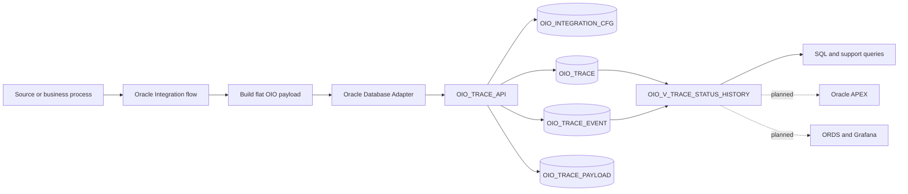

# Oracle Integration Observability

A reference implementation for structured fault handling and business-oriented observability in Oracle Integration.

Oracle Integration Observability (OIO) captures technical execution data together with business context, persists a searchable transaction history in Oracle Database, and provides a foundation for operational views, Oracle APEX applications, and Grafana dashboards.

> Project status: active development. The database artifacts and PL/SQL API are implemented but still require validation in a clean Oracle Database environment before the first tested release.

## Why this project exists

Native Oracle Integration monitoring is essential for troubleshooting integration instances, but support teams frequently need additional business context:

- Which business transaction was processed?
- Which Oracle Integration instance handled it?
- What is the latest transaction status?
- Which status changes occurred during the transaction lifecycle?
- Was the event informational, a business error, or a technical error?
- Was a sanitized request or response retained for investigation?

OIO provides a structured persistence model for answering those questions without replacing Oracle Integration's native monitoring capabilities.

## Architecture overview



The canonical logging contract is intentionally flat. Oracle Integration maps the execution and business context into a single JSON object, while `OIO_TRACE_API` validates and normalizes the data into the database model.

For the complete design, see [Architecture](docs/architecture.md).

## Design principles

- Business context is part of observability.
- The canonical JSON contract remains flat to reduce mapping complexity in Oracle Integration.
- Integration-specific attributes and transaction identifiers are metadata-driven.
- Master transaction data, chronological events, and optional payloads are stored separately.
- Payload storage is optional and must be selective.
- Oracle Integration can use a dedicated runtime schema with no direct table access.
- A logging failure must not replace or hide the original business or technical fault.

## Current components

| Component | Status |
|---|---|
| Database model | Implemented; runtime validation pending |
| PL/SQL API | Implemented; compilation and execution validation pending |
| Flat JSON logging contract | Documented |
| JSON examples | Available |
| Architecture documentation | Available |
| Oracle Integration implementation | Planned |
| Oracle APEX operational console | Planned |
| ORDS and Grafana extension | Planned |
| Automated deployment and tests | Planned |

## Repository structure

```text
oracle-integration-observability/
├── contracts/
│   └── examples/
│       ├── README.md
│       ├── 01_create_success.json
│       ├── 02_create_business_error.json
│       ├── 03_create_technical_error.json
│       ├── 04_create_po_sync_success.json
│       ├── 05_update_status_resolved.json
│       └── 06_update_status_in_progress.json
├── database/
│   └── install/
│       ├── README.md
│       ├── 00_oio_owner_creation.sql
│       ├── 00_oio_runtime_creation.sql
│       ├── 01_oio_integration_cfg.sql
│       ├── 02_oio_trace.sql
│       ├── 03_oio_trace_event.sql
│       ├── 04_oio_trace_payload.sql
│       ├── 05_oio_views.sql
│       ├── oio_trace_api_pks.sql
│       ├── oio_trace_api_pkb.sql
│       ├── sample_data_oio.sql
│       └── validation_queries_oio.sql
├── docs/
│   ├── architecture.md
│   └── logging-contract.md
└── README.md
```

## Database model

OIO uses the following database objects:

| Object | Responsibility |
|---|---|
| `OIO_INTEGRATION_CFG` | Metadata-driven registry of integrations allowed to write to OIO |
| `OIO_TRACE` | Master record for the traced business transaction |
| `OIO_TRACE_EVENT` | Chronological event and transaction-status history |
| `OIO_TRACE_PAYLOAD` | Optional request and response payloads linked to a specific event |
| `OIO_V_TRACE_STATUS_HISTORY` | Support view combining stable transaction data with event history |
| `OIO_TRACE_API` | Public PL/SQL interface used to validate and persist logging events |

The database security model separates ownership from runtime access:

- `OIO_OWNER` owns the database objects.
- `OIO_RUNTIME` is optional and intended for the Oracle Integration connection.
- `OIO_RUNTIME` receives `CREATE SESSION` and `EXECUTE` on `OIO_OWNER.OIO_TRACE_API`.
- No direct table privileges are required for the runtime user.

## Public PL/SQL API

The current package exposes:

```text
OIO_TRACE_API.PR_CREATE_TRACE_LOG
OIO_TRACE_API.PR_UPDATE_TRANSACTION_STATUS
OIO_TRACE_API.REGISTER_EVENT_JSON
```

The package accepts the flat contract, validates the configured `integrationKey`, and normalizes the values into the master, event, and optional payload tables.

## Logging contract

The canonical contract uses:

- `application/json`
- UTF-8 encoding
- camel-case property names
- a flat top-level JSON object
- string values for metadata-driven attributes
- escaped JSON, XML, or text inside `requestPayload` and `responsePayload`

Example:

```json
{
  "integrationKey": "FIN_AP_PAYMENT_FLOW",
  "correlationId": "AP-PAYMENT-2026-000184",
  "oicInstanceId": "987654321001",
  "userName": "OIC",
  "logLevel": "I",
  "summary": "Invoice payment request received successfully.",
  "errorCode": null,
  "errorMessage": null,
  "attr1Value": "INV-100458",
  "attr2Value": "SUP-00321",
  "attr3Value": "Brazil Business Unit",
  "attr4Value": "BRL",
  "attr5Value": "15750.90",
  "attr6Value": null,
  "attr7Value": null,
  "attr8Value": null,
  "attr9Value": null,
  "attr10Value": null,
  "transactionId1": "INV-100458",
  "transactionId2": "PAY-908771",
  "transactionId3": "PAY-BATCH-20260805-01",
  "transactionStatus": "RECEIVED",
  "requestPayload": null,
  "responsePayload": null
}
```

See:

- [Logging contract](docs/logging-contract.md)
- [JSON examples](contracts/examples/README.md)

## Prerequisites

The current artifacts target an Oracle Database environment capable of supporting:

- Oracle identity columns
- interval-partitioned tables
- PL/SQL packages
- CLOB storage
- the `APEX_JSON` package used by the current parser

You also need:

- a privileged database account to create the owner and optional runtime users;
- a SQL client such as SQLcl, SQL*Plus, or Oracle Database Actions;
- an Oracle Integration environment for the future end-to-end implementation;
- a Database Adapter connection when the OIC artifacts are added.

Because runtime validation is still pending, verify all scripts in a clean non-production environment before adopting them.

## Database installation

Review the detailed instructions in [database/install/README.md](database/install/README.md).

High-level sequence:

1. Create `OIO_OWNER`.
2. Create the configuration, trace, event, and payload tables.
3. Create the support view.
4. Compile the `OIO_TRACE_API` package specification and body.
5. Optionally create `OIO_RUNTIME` and grant package execution.
6. Load sample configuration and events.
7. Run the validation queries.

Do not run the scripts in production before completing environment-specific review and validation.

## Validation

The repository currently includes:

- `sample_data_oio.sql` for sample configuration and trace data;
- `validation_queries_oio.sql` for model-level verification;
- flat JSON examples for create and status-update operations.

The first tested release should confirm:

- all database objects compile as `VALID`;
- the package accepts the documented JSON contract;
- one create operation produces a master trace and an initial event;
- optional request or response content produces a payload row;
- status updates append chronological events;
- `OIO_RUNTIME` can execute the package without direct table access;
- the Oracle Integration Database Adapter can invoke the public API.

## Documentation

- [Architecture](docs/architecture.md)
- [Logging contract](docs/logging-contract.md)
- [Database installation](database/install/README.md)
- [Flat JSON examples](contracts/examples/README.md)

## Companion articles

- [From Fault Handling to Observability: Building a Monitoring Framework with Oracle Integration Cloud](https://medium.com/@lcarmo2701/from-fault-handling-to-observability-building-a-monitoring-framework-with-oracle-integration-cloud-407b34755cd0)
- [Beyond Technical Logs: Leveraging the Potential of Grafana with OIC](https://medium.com/@lcarmo2701/beyond-technical-logs-leveraging-the-potential-of-grafana-with-oic-bd653055e021)

The first article introduces the core observability architecture. The second explores a future visualization and alerting extension using Grafana.

## Security considerations

Never commit or publish:

- database passwords;
- OCI wallets or private keys;
- Oracle Integration credentials;
- OAuth tokens or authorization headers;
- production endpoints containing sensitive identifiers;
- unmasked personal, financial, or regulated data;
- complete production payloads when a reduced diagnostic representation is sufficient.

Payload retention must be intentional. Sanitize sensitive values before persistence and define access and retention rules appropriate to the implementation.

## Known limitations

- The database scripts and package still require clean-environment runtime validation.
- No Oracle Integration export or reusable OIC integration is included yet.
- No Oracle APEX application, ORDS endpoint, Grafana dashboard, or alert rule is included yet.
- Transaction statuses are business-defined and are not globally constrained by the database.
- Attribute positions are generic and depend on metadata configured for each integration.
- A status update may affect multiple traces when the supplied transaction identifiers are not unique.
- No automated purge or retention process is included.
- No automated installation or regression test pipeline is included.

## Roadmap

### v0.1 - Core database and contract

- Database model
- PL/SQL API
- Flat JSON contract
- JSON examples
- Architecture documentation
- Installation and validation guidance
- Clean-environment database validation

### v0.2 - Oracle Integration implementation

- Database Adapter connection guidance
- Field mapping reference
- Scope and global fault-handler patterns
- Sample Oracle Integration orchestration
- Sanitized integration export
- End-to-end validation evidence

### Future increments

- Oracle APEX operational console
- Analytical views
- ORDS endpoints and OpenAPI definition
- Grafana dashboard and alerting examples
- Retention and purge utilities
- Automated SQL and documentation validation

## Contributing

Issues and pull requests are welcome once the first validated release is available.

When proposing a change:

- keep the canonical contract flat;
- preserve metadata-driven field behavior;
- avoid environment-specific credentials and identifiers;
- use anonymized sample data;
- document database and Oracle Integration compatibility;
- explain any change to public package behavior.

## License

[](https://opensource.org)

## Disclaimer

This project is an independent technical reference based on personal implementation experience. It is not an Oracle product and does not constitute official Oracle documentation, support guidance, or a warranty of production suitability.
