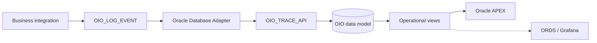

# Oracle Integration Observability

A reference implementation for structured fault handling and business-oriented observability in Oracle Integration.

Oracle Integration Observability (OIO) captures technical execution data together with business context, persists a searchable transaction history in Oracle Database, and provides an operational console in Oracle APEX.

> Project status: implementation v1 is complete in the reference environment. Clean-environment validation is still required before a tagged tested release.

## Why this project exists

Native Oracle Integration monitoring is essential for technical troubleshooting, but support teams often need additional business context such as transaction identifiers, lifecycle status, error details, and selected request or response payloads.

OIO adds that context without replacing Oracle Integration native monitoring.

## Architecture overview



The canonical logging contract is intentionally flat. Oracle Integration maps execution and business context into a single JSON object, while `OIO_TRACE_API` validates and persists the information in the database model.

For the complete design, see [Architecture](docs/architecture.md).

## Design principles

- Business context is part of observability.
- The canonical JSON contract remains flat to reduce mapping complexity.
- Integration-specific attributes and transaction identifiers are metadata-driven.
- Master transaction data, chronological events, and optional payloads are stored separately.
- Payload storage is optional and must be selective.
- Database access follows least privilege.
- Observability persistence must not replace the original business or technical fault.

## Current components

| Component | Status |
|---|---|
| Database model and PL/SQL API | Implemented |
| Flat JSON logging contract and examples | Available |
| Oracle Integration implementation and exports | Available |
| Oracle APEX operational console | Available |
| English / Brazilian Portuguese APEX translation | Available |
| Clean-environment validation | Required before a tagged tested release |
| ORDS and Grafana extension | Available |
| Automated deployment and regression tests | Outside v1 |

## Repository structure

```text
oracle-integration-observability/
├── apex/
│   ├── export/
│   ├── install/
│   ├── screenshots/
│   └── translations/
├── contracts/
│   └── examples/
├── database/
│   ├── demo/
│   └── install/
├── docs/
├── oic/
│   ├── export/
│   └── screenshot/
├── LICENSE
└── README.md
```

## Quick start

1. Review [database/install/README.md](database/install/README.md) and install the OIO database objects.
2. Configure the Oracle Integration Database Adapter connection and import the artifacts under [`oic/export/`](oic/export/).
3. Optionally load the synthetic demonstration data under [`database/demo/`](database/demo/).
4. Optionally create the APEX parsing schema using [`apex/install/`](apex/install/) and import the application from [`apex/export/f101/`](apex/export/f101/).
5. Run the supplied validation queries before adopting the implementation in another environment.

The current implementation uses Oracle identity columns, interval-partitioned tables, PL/SQL packages, CLOB storage, and `APEX_JSON`.

## Documentation

- [Architecture](docs/architecture.md)
- [Logging contract](docs/logging-contract.md)
- [Database installation](database/install/README.md)
- [Oracle Integration implementation](oic/README.md)
- [APEX operational console](apex/README.md)
- [JSON examples](contracts/examples/README.md)

## Companion articles

- [From Fault Handling to Observability: Building a Monitoring Framework with Oracle Integration Cloud](https://medium.com/@lcarmo2701/from-fault-handling-to-observability-building-a-monitoring-framework-with-oracle-integration-cloud-407b34755cd0)
- [Beyond Technical Logs: Leveraging the Potential of Grafana with OIC](https://medium.com/@lcarmo2701/beyond-technical-logs-leveraging-the-potential-of-grafana-with-oic-bd653055e021)

## Security considerations

Do not publish credentials, wallets, private keys, tokens, private endpoints, or unmasked production data.

Request and response payload persistence is optional and may contain personal, financial, confidential, or regulated information. Each implementation must define appropriate masking, access, retention, deletion, privacy, and compliance controls. When payload retention is not required, leave `requestPayload` and `responsePayload` unset.

## Known limitations

- A clean-environment end-to-end validation has not yet been published.
- Transaction statuses are business-defined and are not globally constrained by the database.
- Generic attribute positions depend on the metadata configured for each integration.
- A status update may affect multiple traces when the supplied transaction identifiers are not unique.
- No automated purge, retention, installation, or regression-test pipeline is included.

## License

[](https://opensource.org/licenses/Apache-2.0)

## Disclaimer

This project is an independent technical reference based on personal implementation experience. It is not an Oracle product and does not constitute official Oracle documentation, support guidance, or a warranty of production suitability.
