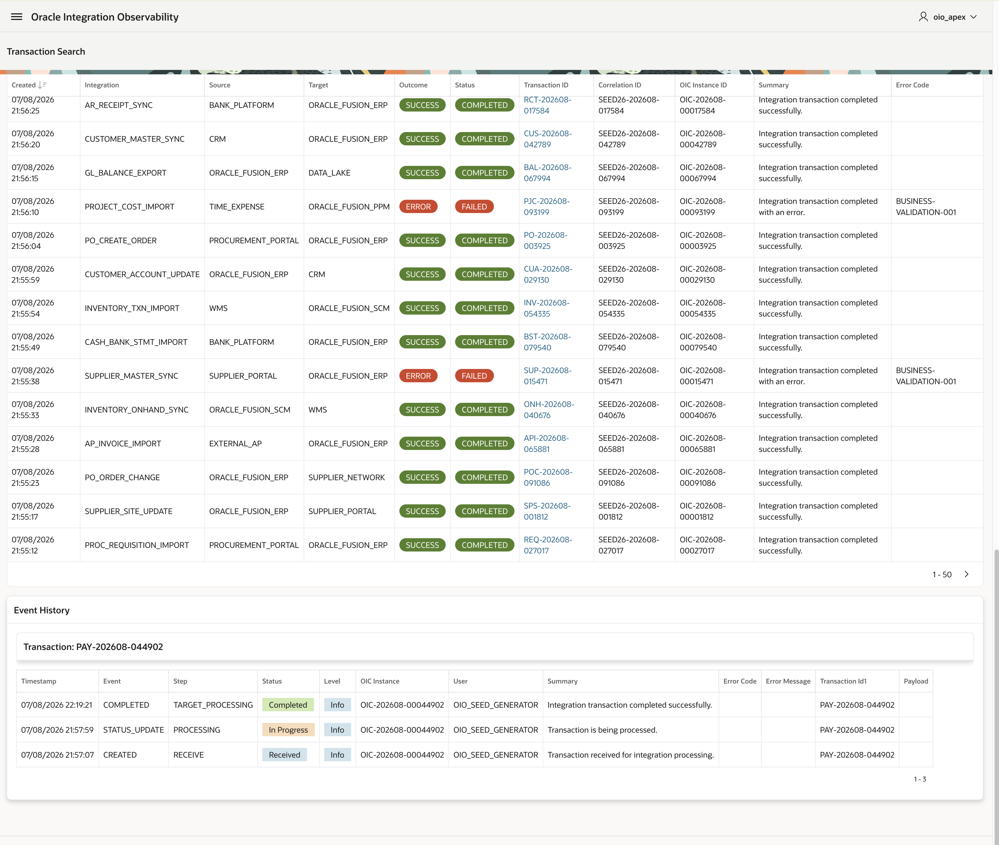
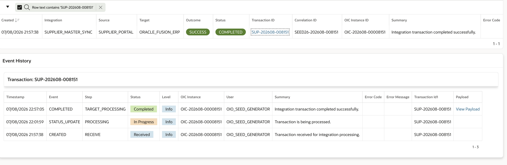

# Oracle Integration Observability - APEX Operational Console

This directory contains the Oracle APEX operational console for the **Oracle Integration Observability (OIO)** reference implementation.

The application provides a read-only support interface for monitoring integration transactions, reviewing their event history, and inspecting persisted request and response payloads when available.

> This application is an independent technical reference implementation and is not official Oracle documentation.

## Overview

The console complements the OIO persistence and Oracle Integration layers by providing an operational UI focused on troubleshooting and transaction analysis.

```text
Transaction Search
        |
        | select transaction
        v
Event History
        |
        | payload available
        v
Payload Viewer
   |           |
 Request    Response
```

Key capabilities include:

- Transaction search with bounded time filtering
- Filtering by integration, outcome, status, source, and target
- Custom date-range searches with a maximum 90-day interval
- AJAX-based transaction selection and event-history refresh
- Inline event-history drill-down
- Modal request/response payload viewer
- Redwood-compatible visual treatment for status, outcome, and severity
- Read-only access to the OIO observability model

## Architecture

The reference deployment uses a dedicated APEX parsing schema:

```text
OIO_OWNER
   |
   | SELECT on read-only views
   v
OIO_APEX
   |
   | Parsing Schema
   v
Oracle APEX Application
```

`OIO_OWNER` owns the observability persistence model and PL/SQL API.

`OIO_APEX` is the parsing schema used by the application and requires only read access to the views consumed by the UI.

The application currently consumes:

- `OIO_V_TRACE_CURRENT`
- `OIO_V_TRACE_STATUS_HISTORY`
- `OIO_V_TRACE_PAYLOAD`

Example grants:

```sql
grant select on oio_v_trace_current
    to oio_apex;

grant select on oio_v_trace_status_history
    to oio_apex;

grant select on oio_v_trace_payload
    to oio_apex;
```

No direct DML access to the underlying OIO tables is required.

## Transaction Search

The main page is designed for operational support and troubleshooting.

It provides:

- mandatory bounded time filtering
- integration filtering
- outcome and status filtering
- source and target filtering
- custom date ranges limited to 90 calendar days
- Interactive Report capabilities for additional end-user sorting and filtering

A selected transaction is kept as transient UI state and its event history is refreshed through AJAX without reloading the complete page.

## Event History

The Event History region presents the lifecycle of the selected transaction.

It exposes the event timestamp, event type, processing step, transaction status, severity, OIC instance, user, summary, and error information.

Technical severity values are translated in the presentation layer:

```text
I -> Info
E -> Error
```

Status and severity are rendered using semantic Redwood-compatible styling to improve operational scanning without changing the underlying stored values.

## Payload Viewer

If an event has a persisted payload, the Event History exposes a **View Payload** action.

The modal displays contextual information for the selected event together with:

- Transaction ID
- Integration
- Event
- Step
- Status
- Severity
- Request payload
- Response payload

Payload persistence is optional.

Request and response content may contain personal, financial, confidential, or regulated information. Each implementation should define appropriate security, privacy, masking, retention, and deletion controls before enabling payload storage.

## APEX Export

The application export is stored under:

```text
apex/export/f101/
```

The repository uses the **split application export** format so that pages and shared components can be reviewed and versioned independently.

```text
f101/
├── install.sql
└── application/
    ├── create_application.sql
    ├── pages/
    ├── shared_components/
    └── ...
```

The reference application ID is:

```text
101
```

## Installation

Before importing the application:

1. Install the OIO database objects.
2. Create or identify the APEX parsing schema.
3. Grant the parsing schema `SELECT` access to the required OIO views.
4. Associate the parsing schema with the target APEX workspace.
5. Import the application export.

The split export can be installed using:

```text
apex/export/f101/install.sql
```

The application can also be imported through Oracle APEX App Builder.

### Parsing Schema

The reference environment uses:

```text
OIO_APEX
```

A different parsing schema can be selected during import as long as it can access the required OIO objects.

The current export contains SQL references to the `OIO_OWNER` schema. If the observability objects are deployed under a different owner, review those references after import.

## Screenshots

### Transaction Search


### Event History





### Payload Viewer


## Repository Structure

```text
apex/
├── README.md
├── export/
│   └── f101/
│       ├── install.sql
│       └── application/
└── screenshots/
    ├── transaction-event-history-payload_01.png
    ├── transaction-search-01.png
    ├── transaction-search-02.png
    ├── transaction-search_event_history_01.png
    └── transaction-search_event_history_02.png
```

## Next Evolution

The next planned extension is the monitoring dashboard layer, including transaction volume, success/error distribution, and top integrations by error count.

Other potential enhancements include JSON/XML payload formatting, schema-independent deployment, and role-based access control.

## Related Components

The APEX console is one layer of the broader Oracle Integration Observability reference implementation.

- [`../README.md`](../README.md) - project overview
- [`../docs/architecture.md`](../docs/architecture.md) - architecture
- [`../docs/logging-contract.md`](../docs/logging-contract.md) - logging contract
- [`../database/install/`](../database/install/) - database objects and PL/SQL API
- [`../oic/`](../oic/) - Oracle Integration implementation

## License

This project is licensed under the Apache License 2.0. See [`../LICENSE`](../LICENSE).
