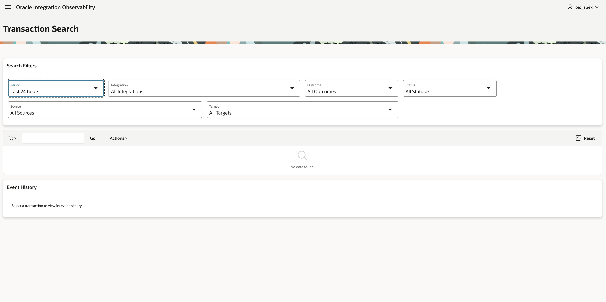
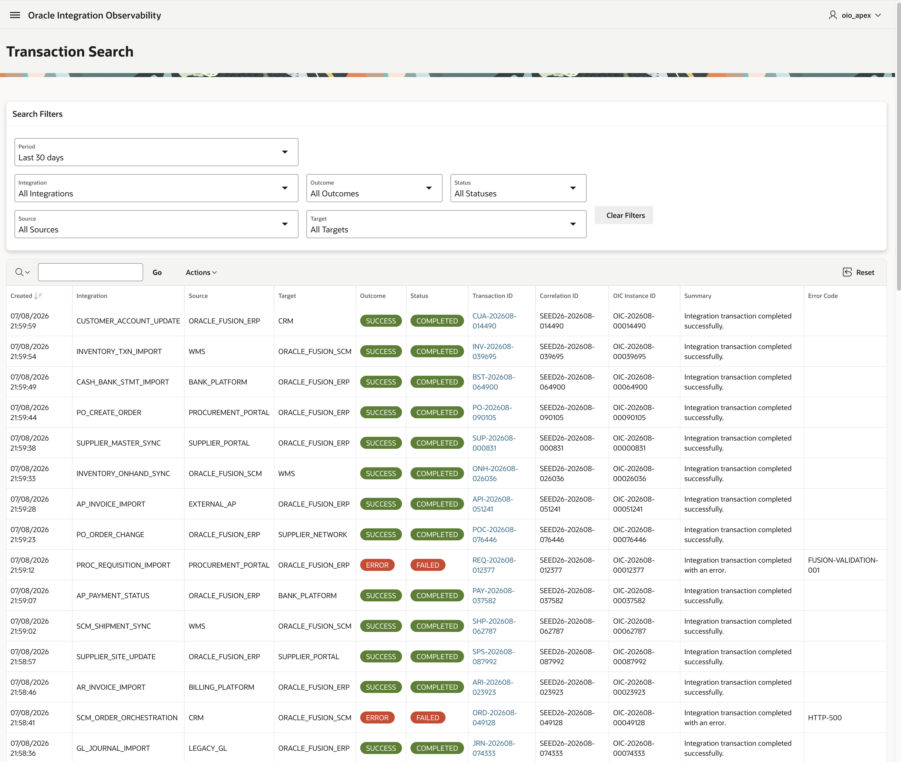

# Oracle Integration Observability - APEX Operational Console

This directory contains the read-only Oracle APEX operational console for the Oracle Integration Observability (OIO) reference implementation.

The v1 console provides monitoring, transaction investigation, technical troubleshooting, and optional payload inspection over the OIO database model.

> This application is an independent technical reference implementation and is not official Oracle documentation.

## Capabilities

| Area | Purpose |
|---|---|
| Monitoring Dashboard | Operational KPIs, success/error distribution, transaction volume, and integrations with the most errors. |
| Transaction Search | Bounded transaction search with business and technical filters. |
| Event History | Chronological lifecycle of a selected transaction. |
| Technical Operations | Error trends, error codes, recent error events, and potentially stuck transactions. |
| Payload Viewer | Request and response payload inspection when payload data was retained. |

The console supports predefined time periods and custom date ranges limited to 90 calendar days. Technical reports can navigate directly to Transaction Search using the internal `TRACE_ID` as the trace identity.

## Potentially stuck heuristic

A transaction is considered potentially stuck when:

```text
Current Status = RECEIVED or IN_PROGRESS
AND
No new event has been recorded for more than 30 minutes
```

This is an operational heuristic, not authoritative proof that an Oracle Integration instance is stuck. Implementations may require a different threshold.

## Architecture and security

The reference deployment uses a dedicated parsing schema:

```text
OIO_OWNER
   |
   | read-only access
   v
OIO_APEX
   |
   v
Oracle APEX Application
```

The application consumes:

- `OIO_V_TRACE_CURRENT`
- `OIO_V_TRACE_STATUS_HISTORY`
- `OIO_V_TRACE_PAYLOAD`
- `OIO_INTEGRATION_CFG`

`OIO_APEX` is an optional consumer schema and does not require DML access to trace tables or `EXECUTE` on `OIO_TRACE_API`.

Reference setup scripts:

```text
apex/install/
├── 00_oio_apex_creation.sql
└── 01_oio_apex_grants.sql
```

The grants script provides only the read privileges required by the UI. `CREATE SESSION` is granted by the reference schema-creation script for administration and deployment use.

A different parsing schema can be used if equivalent privileges are provided. The current application SQL references `OIO_OWNER` explicitly, so deployments using another owner must review those references.

## Internationalization

The reference application uses English as its primary language and includes Brazilian Portuguese.

```text
Primary application:    101
Translated application: 10002
Language:               pt-br
```

The XLIFF artifact is stored under:

```text
apex/translations/f101_10002_en_pt-br.xlf
```

Declarative component text is maintained through the APEX translation repository/XLIFF. SQL-generated translated text should use APEX Text Messages.

## Styling

Shared OIO-specific CSS is stored as an APEX Static Application File:

```text
css/oio.css
```

It is loaded at application level. Semantic colors use Universal Theme / Redwood-compatible classes where appropriate.

## Installation

1. Install the OIO database objects under `OIO_OWNER`.
2. Create or select an APEX workspace.
3. Create `OIO_APEX` with `apex/install/00_oio_apex_creation.sql`, or use another parsing schema.
4. Associate the parsing schema with the workspace.
5. Apply `apex/install/01_oio_apex_grants.sql` or equivalent read grants.
6. Import the application from `apex/export/f101/install.sql` or through App Builder.
7. Publish the translated application when Brazilian Portuguese is required.

## Application export

The application is versioned as a split export under:

```text
apex/export/f101/
```

The export includes a readable representation to make application changes easier to review in source control. Significant application changes should be followed by a fresh split export and translation synchronization.

## Screenshots

### Transaction Search





### Event History


### Payload Viewer


## Data protection

Payload persistence is optional. Request and response content may contain personal, financial, confidential, or regulated information. Implementations must define appropriate masking, access, retention, and deletion controls, and should omit payload collection when it is not operationally required.

## Related components

- [Project overview](../README.md)
- [Architecture](../docs/architecture.md)
- [Logging contract](../docs/logging-contract.md)
- [Database installation](../database/install/README.md)
- [Oracle Integration implementation](../oic/README.md)

## License

This project is licensed under the Apache License 2.0. See [`../LICENSE`](../LICENSE).
