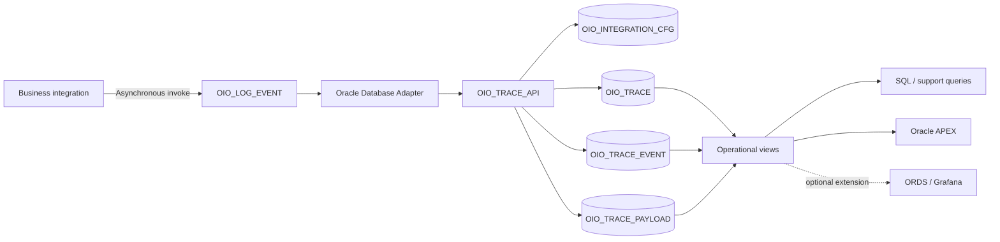
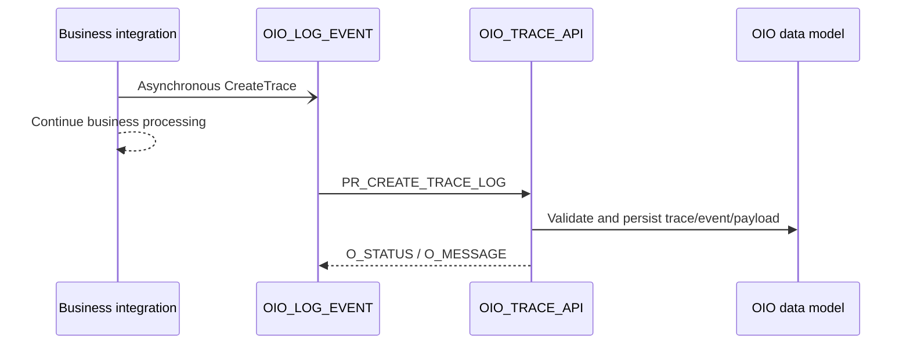
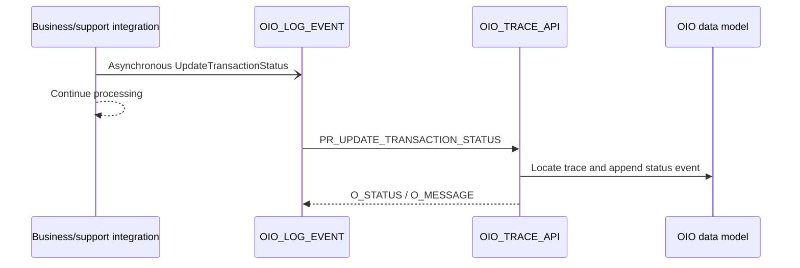
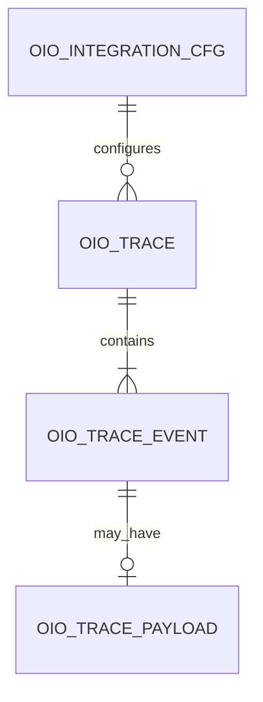

# Oracle Integration Observability Architecture

## 1. Purpose

Oracle Integration Observability (OIO) is a reference implementation for capturing Oracle Integration execution data together with business context and persisting a searchable transaction history outside the integration runtime.

OIO complements Oracle Integration native monitoring. It does not replace it.

## 2. Scope

The v1 implementation includes:

- metadata-driven integration configuration;
- a flat JSON logging contract;
- transaction master, event history, and optional payload persistence;
- the `OIO_TRACE_API` PL/SQL entry point;
- asynchronous Oracle Integration logging through `OIO_LOG_EVENT`;
- the `OIO_SAMPLE_BUSINESS_FLOW` reference integration;
- operational database views;
- a read-only Oracle APEX operational console.

ORDS, Grafana, automated deployment pipelines, and prescriptive purge or retention automation are outside the current v1 scope.

## 3. Design principles

### Business context is part of observability

Technical instance identifiers are useful, but business support also needs transaction identifiers, lifecycle status, configurable attributes, and error context.

### The contract remains flat

The canonical JSON contract uses a flat structure to keep Oracle Integration mappings simple. Persistence normalization is handled by `OIO_TRACE_API`.

### Integration-specific meaning is metadata-driven

`ATTR1_VALUE` through `ATTR10_VALUE` and `TRANSACTION_ID1` through `TRANSACTION_ID3` are generic physical fields. Their meaning is defined by `OIO_INTEGRATION_CFG`.

### Transaction data, history, and payloads are separated

Stable trace information, chronological events, and optional large payloads are stored independently so routine operational queries do not depend on CLOB content.

### Database access follows least privilege

Database ownership, Oracle Integration runtime access, and APEX read access use separate schemas and privileges.

### Observability persistence is asynchronous

The parent business integration dispatches logging events to `OIO_LOG_EVENT`. The parent continues after Oracle Integration accepts the asynchronous handoff; database persistence completes independently in the child instance.

## 4. Logical architecture

A successful asynchronous handoff confirms that Oracle Integration accepted the child request. It does not guarantee that the later database write completed successfully.

## 5. Core components

| Component | Responsibility |
|---|---|
| `OIO_INTEGRATION_CFG` | Registry and metadata definition for integrations using OIO. |
| `OIO_TRACE` | Master record for a traced business transaction. |
| `OIO_TRACE_EVENT` | Chronological event and transaction-status history. |
| `OIO_TRACE_PAYLOAD` | Optional request and response payload associated with an event. |
| `OIO_TRACE_API` | Public PL/SQL interface used by the Oracle Integration logger. |
| `OIO_LOG_EVENT` | Reusable asynchronous Oracle Integration logging component. |
| `OIO_V_TRACE_CURRENT` | Current transaction-oriented operational view. |
| `OIO_V_TRACE_STATUS_HISTORY` | Event and status-history operational view. |
| `OIO_V_TRACE_PAYLOAD` | Read model used to inspect persisted payloads. |
| Oracle APEX console | Read-only monitoring and troubleshooting interface. |

Field-level behavior and validation rules are defined in the [logging contract](logging-contract.md). Oracle Integration implementation details are maintained under [`oic/`](../oic/README.md).

## 6. Processing flows

### Create trace

A successful create operation produces one trace master record and one initial event. A payload row is created only when request or response content is provided.

### Update transaction status

Status updates use `integrationKey` plus the non-null transaction identifiers supplied in the payload. If multiple traces satisfy the criteria, the current implementation updates every match.

## 7. Data relationships

The current transaction status is derived from event history rather than maintained as a separate authoritative status field in the trace master.

## 8. Security boundaries

### `OIO_OWNER`

Owns the database tables, views, constraints, indexes, and `OIO_TRACE_API` package.

### `OIO_RUNTIME`

Optional runtime schema for the Oracle Integration Database Adapter. The reference model grants `CREATE SESSION` and `EXECUTE` on `OIO_OWNER.OIO_TRACE_API`, without direct table access.

### `OIO_APEX`

Optional parsing schema for the APEX operational console. It receives read-only access only to the OIO views and configuration data required by the application. See [`apex/README.md`](../apex/README.md) for the reference grants.

### Payload data

Payload retention must be selective. Implementations should sanitize sensitive content, restrict access, and define retention and deletion controls appropriate to their regulatory and operational requirements.

## 9. Scalability and retention

`OIO_TRACE`, `OIO_TRACE_EVENT`, and `OIO_TRACE_PAYLOAD` use monthly interval partitioning by creation date. This supports time-based operational queries and partition-oriented retention strategies.

No automatic purge job or universal retention period is included. Retention remains an implementation-specific decision.

## 10. v1 boundaries and limitations

- Clean-environment end-to-end validation has not yet been published.
- Transaction statuses are business-defined and are not globally constrained by the database.
- Generic attribute positions require metadata configuration for each integration.
- Status-update matching can affect multiple traces when the supplied identifiers are not unique.
- JSON is the canonical contract; the package also contains XML compatibility parsing.

## 11. Related documentation

- [Logging contract](logging-contract.md)
- [Database installation](../database/install/README.md)
- [Oracle Integration implementation](../oic/README.md)
- [APEX operational console](../apex/README.md)
- [JSON examples](../contracts/examples/README.md)
- [ORDS / Grafana extension](docs/grafana-extension.md)