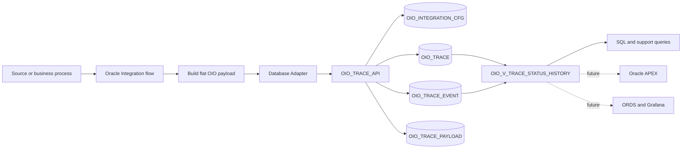
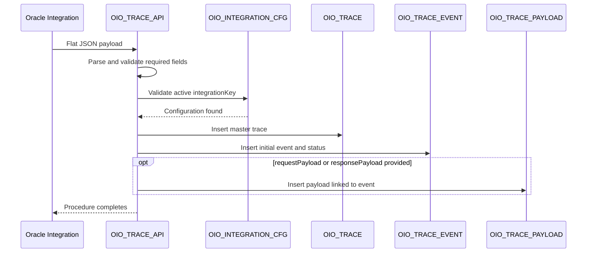
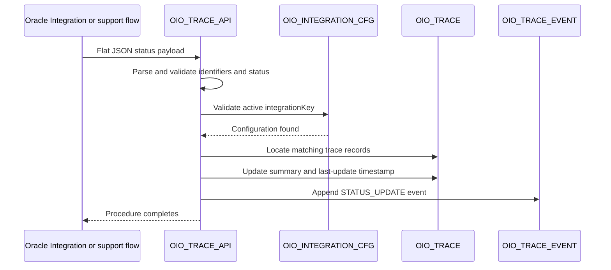
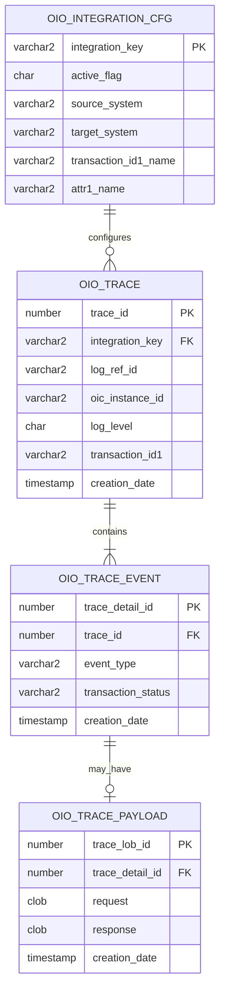

# Oracle Integration Observability Architecture

## 1. Purpose

Oracle Integration Observability (OIO) is a reference implementation for capturing technical execution data together with business context from Oracle Integration.

The solution extends native integration monitoring by persisting a structured and searchable history outside Oracle Integration. Its primary goal is to help support and business teams answer questions such as:

- Which business transaction was processed?
- Which Oracle Integration instance handled it?
- What was the latest known transaction status?
- Which status changes occurred during the transaction lifecycle?
- Was the event informational or related to an error?
- Which request or response payload was retained for investigation?

This repository complements the article [From Fault Handling to Observability: Building a Monitoring Framework with Oracle Integration Cloud](https://medium.com/@lcarmo2701/from-fault-handling-to-observability-building-a-monitoring-framework-with-oracle-integration-cloud-407b34755cd0).

## 2. Scope

The current implementation includes:

- A metadata-driven integration registry.
- A flat JSON logging contract.
- A transaction-level trace record.
- A chronological event and status history.
- Optional CLOB storage for request and response payloads.
- A PL/SQL API used as the database entry point.
- A support view that exposes the current status together with the complete history.
- Separate owner and optional runtime database users.

The current version does not include:

- An Oracle Integration export package.
- An Oracle APEX application export.
- ORDS endpoints.
- Grafana dashboards or alert rules.
- Automated deployment pipelines.
- A prescriptive retention or purge policy.

These items may be added in later repository versions.

## 3. Design principles

### 3.1 Business context is part of observability

An Oracle Integration instance identifier is useful for technical troubleshooting, but it is rarely sufficient for business support. OIO stores business transaction identifiers and configurable attributes alongside execution information.

### 3.2 The logging payload remains flat

The canonical JSON contract is intentionally flat. This reduces mapping complexity in Oracle Integration and keeps the normalization logic inside `OIO_TRACE_API`.

### 3.3 Integration-specific meaning is metadata-driven

The physical columns `ATTR1_VALUE` through `ATTR10_VALUE` and `TRANSACTION_ID1` through `TRANSACTION_ID3` are generic. Their business meaning is defined by the matching row in `OIO_INTEGRATION_CFG`.

### 3.4 Transaction data and history are separated

The model distinguishes between:

- The trace master record and stable identifiers.
- The chronological sequence of events and status changes.
- Optional large payloads associated with a specific event.

### 3.5 Payload storage is optional

Request and response payloads are stored only when provided. They are separated from the main trace tables to avoid making routine operational queries dependent on CLOB columns.

### 3.6 Database access follows least privilege

`OIO_OWNER` owns the database objects. The optional `OIO_RUNTIME` user is intended for the Oracle Integration database connection and receives only `CREATE SESSION` and `EXECUTE` on `OIO_TRACE_API`.

## 4. Logical architecture



## 5. Components

### 5.1 Oracle Integration flow

The business integration is responsible for collecting the values required by the logging contract. Depending on the implementation, the logger may be called from:

- The main orchestration flow.
- A scope fault handler.
- A global fault handler.
- A retry or reprocessing flow.
- A support operation that changes the business transaction status.

The integration sends the complete flat payload as a CLOB to the PL/SQL API through the Oracle Database Adapter.

### 5.2 `OIO_INTEGRATION_CFG`

This table is the mandatory registry of integrations allowed to write to OIO.

Each `integrationKey` must have a corresponding active configuration. The configuration provides:

- Integration description and type.
- Source and target systems.
- Process and scope information.
- Labels for up to three transaction identifiers.
- Labels for up to ten integration-specific attributes.

The configuration separates the physical logging contract from the business meaning of each generic field.

### 5.3 `OIO_TRACE`

This is the master record for a traced business transaction.

It stores:

- The configured integration key.
- Correlation and Oracle Integration instance identifiers.
- User or service account information.
- Log level, summary, and error information.
- Up to ten metadata-driven attribute values.
- Up to three business transaction identifiers.
- Creation and last-update timestamps.

A new row is created when a create operation is submitted to the API.

### 5.4 `OIO_TRACE_EVENT`

This table stores the chronological history associated with an `OIO_TRACE` record.

Each row may contain:

- Event classification.
- Integration step information.
- Oracle Integration instance identifier.
- User or service account.
- Log level and summary.
- Error code and message.
- Business-defined transaction status.
- Event timestamp.

The current transaction status is derived from the latest event rather than maintained as a separate status column in the master table.

### 5.5 `OIO_TRACE_PAYLOAD`

This table stores optional request and response payloads as CLOB values.

A payload row belongs to a specific `OIO_TRACE_EVENT`, not directly to the master trace. This preserves the relationship between the retained payload and the event that produced it.

Payload storage should be selective. Sensitive, regulated, or high-volume content should be sanitized or omitted according to the implementation's security and retention requirements.

### 5.6 `OIO_TRACE_API`

The package is the public database interface for the framework. The current package exposes:

- `PR_CREATE_TRACE_LOG`
- `PR_UPDATE_TRANSACTION_STATUS`
- `REGISTER_EVENT_JSON`

The package:

- Parses the flat payload.
- Validates the integration key.
- Applies mandatory-field rules.
- Creates the master trace and initial event.
- Appends transaction status events.
- Stores optional request and response payloads.
- Controls the database transaction used by each public operation.

The package uses definer-rights execution so the runtime user does not require direct table privileges.

### 5.7 `OIO_V_TRACE_STATUS_HISTORY`

The support view joins the trace master and event history. It exposes:

- Stable trace and transaction identifiers.
- The latest transaction status.
- Every historical status and event.
- Error information.
- Configurable attribute values.
- Master and event timestamps.

The view is intended as the initial access layer for support queries and future presentation components.

## 6. Main processing flows

### 6.1 Create a trace



A create operation produces one master row and one initial history row. A payload row is created only when at least one payload value is present.

### 6.2 Update transaction status



The current implementation locates records by `integrationKey` and the transaction identifiers provided in the payload. Fields with null transaction identifiers are not included in the match. If more than one trace satisfies the criteria, a status event is appended to every matching trace.

## 7. Data relationships



## 8. Event classification

For trace creation, the package derives the event type using the submitted fields:

1. `ERROR` when `logLevel` is `E`, `errorCode` is populated, or `errorMessage` is populated.
2. `STATUS_EVENT` when a transaction status is populated and the event is not classified as an error.
3. `INFO` when neither of the previous conditions applies.

Because `transactionStatus` is mandatory in the current create operation, a non-error creation event is normally classified as `STATUS_EVENT`.

Status updates are recorded with the event type `STATUS_UPDATE`.

## 9. Transaction and failure behavior

The public procedures use autonomous database transactions.

On successful processing, the package commits the trace data independently from the caller's transaction. On failure, it rolls back the OIO operation and propagates the database exception to the caller.

This design prevents an application rollback from automatically removing an observability record that was already committed. It also means the caller must explicitly decide how a logging failure affects the main integration flow.

A recommended integration rule is:

> A logging failure must not replace or hide the original business or technical fault.

The exact OIC fault-handling implementation is outside the scope of the current database release and should be documented when OIC artifacts are added.

## 10. Security boundaries

### Owner schema

`OIO_OWNER` owns the tables, view, indexes, constraints, and package.

### Runtime schema

`OIO_RUNTIME` is optional. It is intended for the Oracle Integration connection and receives:

- `CREATE SESSION`
- `EXECUTE` on `OIO_OWNER.OIO_TRACE_API`

It does not receive direct table privileges.

### Data protection considerations

Implementations should:

- Avoid storing credentials, access tokens, authorization headers, or database secrets.
- Sanitize personal, financial, and regulated information before persistence.
- Store request and response payloads only when operationally justified.
- Restrict support access to payload data.
- Define retention and purge rules appropriate to data volume and compliance requirements.
- Use non-production or anonymized values in repository examples.

## 11. Scalability and retention

`OIO_TRACE`, `OIO_TRACE_EVENT`, and `OIO_TRACE_PAYLOAD` are range-partitioned by `CREATION_DATE` with monthly interval partitions.

This supports:

- Time-based operational queries.
- Partition-oriented retention strategies.
- Separation of recent operational data from older history.
- More predictable management of high-volume logging data.

No automatic purge job is included in the current release. Retention must be defined by each implementation according to its transaction volume, support requirements, and compliance obligations.

## 12. Repository structure

The relevant repository areas are expected to follow this structure:

```text
oracle-integration-observability/
├── contracts/
│   └── examples/
├── database/
│   ├── install/
│   └── tests/
└── docs/
    ├── architecture.md
    └── logging-contract.md
```

## 13. Current limitations

- The database scripts and package must be validated in a clean target database before being identified as a tested release.
- Transaction statuses are business-defined and are not restricted by a database check constraint.
- The physical attribute fields are generic and require configuration documentation for each integration.
- Status update matching can affect multiple traces when the provided identifiers are not unique.
- The current PL/SQL implementation supports JSON as the canonical contract and also contains XML parsing compatibility logic.
- No user interface or alerting component is included in the current release.

## 14. Planned evolution

Potential future increments include:

- Oracle Integration sample artifacts and mapping guidance.
- APEX operational pages.
- ORDS APIs and OpenAPI definitions.
- Grafana dashboards and alerting examples.
- Automated installation tests.
- Purge and retention utilities.
- CI/CD validation for SQL and documentation artifacts.
