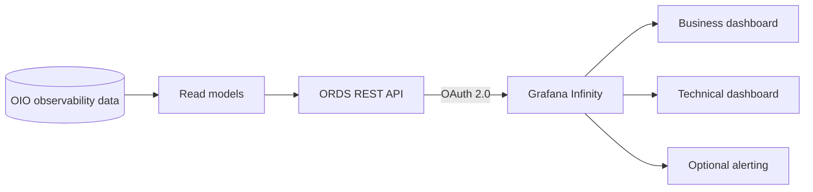
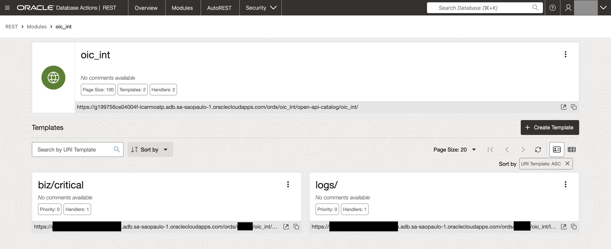
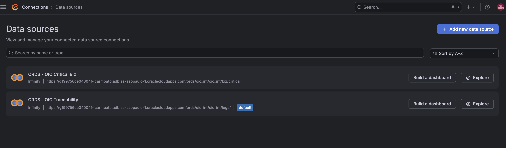
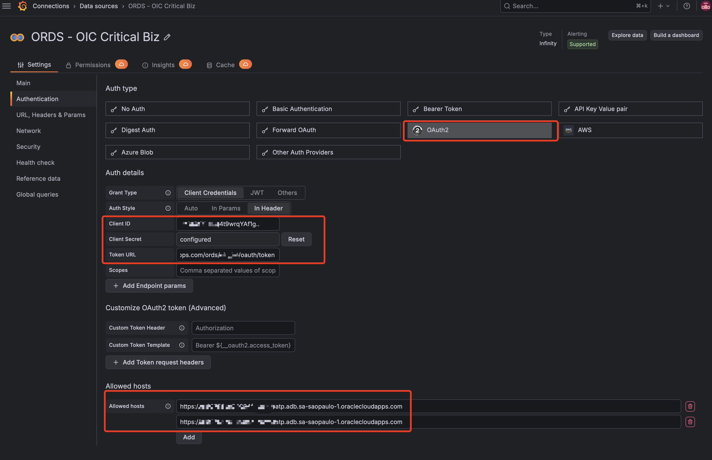
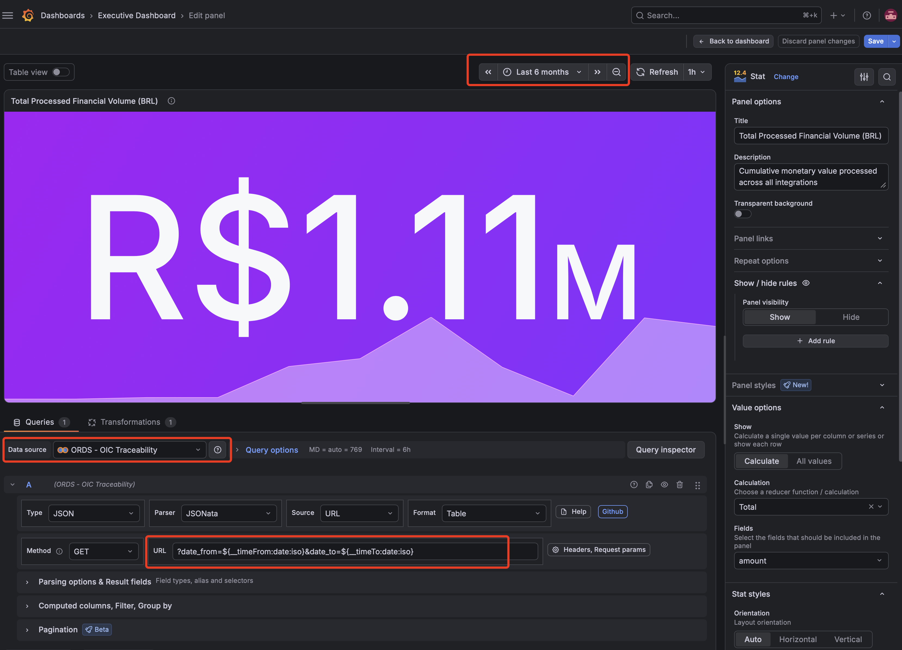
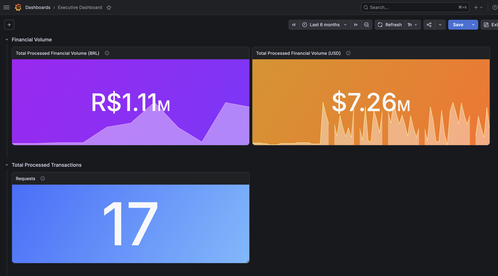
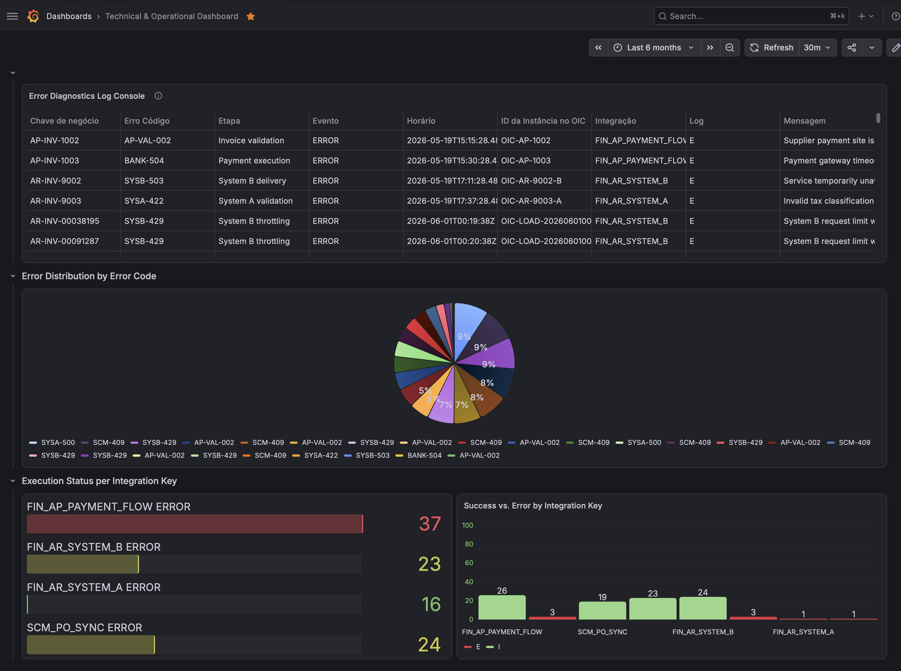
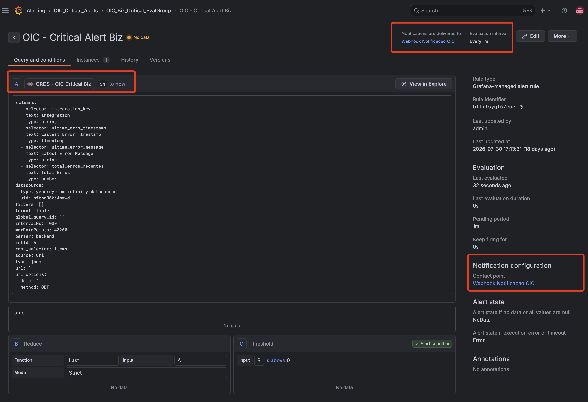

# Optional ORDS / Grafana Extension

## Purpose

Grafana is an optional visualization and alerting extension for Oracle Integration Observability (OIO).

This document records the reference ORDS-to-Grafana pattern used in the proof of concept. It assumes familiarity with Grafana and ORDS and does not attempt to teach either product.

The original implementation was validated in a separate ORDS-enabled schema with the same observability concepts but different physical database object names. To keep this extension reusable, the repository documents the logical read model and REST contract rather than those table or view definitions.

## Prerequisites

| Area | Requirement |
|---|---|
| Grafana | Running environment and basic dashboard/data-source knowledge |
| Data source | Infinity plugin installed |
| ORDS | REST-enabled schema with modules, templates, handlers, roles, and privileges |
| Security | OAuth 2.0 Client Credentials |
| Network | Grafana server can reach the ORDS endpoints |

## Architecture



Oracle APEX remains the operational console delivered with the OIO core implementation. Grafana adds an external visualization layer over read-only REST resources.

## Read model

The proof of concept uses dedicated read models instead of exposing observability tables directly.

| Logical view | Purpose | Grafana use |
|---|---|---|
| Operational history | Transaction identifiers, current status, event history, steps, log level, errors, and business attributes | Technical monitoring and trends |
| Business projection | Same observability history with business-friendly interpretation of identifiers and attributes | Business KPIs and transaction monitoring |
| Critical aggregation | Recent errors grouped by integration with latest error context | Critical panel and optional alerting |

The reference critical aggregation uses a 15-minute window and a threshold of three errors. These values are examples and should be adapted to each environment.

## ORDS design

The reference ORDS module uses the base path `/oic_int/`.



| Method | Resource | Purpose |
|---|---|---|
| `GET` | `/ords/<schema>/oic_int/logs/` | Operational event/history data |
| `GET` | `/ords/<schema>/oic_int/biz/critical` | Aggregated recent critical errors |
| `POST` | `/ords/<schema>/oauth/token` | OAuth 2.0 token endpoint |

The physical schema and database object names are intentionally not part of this contract. REST resources should remain read-only and protected by ORDS roles and privileges.

### Example: operational logs

```json
{
  "items": [{
    "integration_key": "FIN_AR_SYSTEM_B",
    "transaction_id1": "AR-INV-00014819",
    "current_status": "SUCCESS",
    "event_timestamp": "2026-07-01T00:01:18Z",
    "log_level": "I",
    "history_status": "SUCCESS",
    "error_code": null,
    "summary": "Transaction completed successfully"
  }],
  "hasMore": false,
  "count": 1
}
```

### Example: critical errors

```json
{
  "items": [{
    "integration_key": "FIN_AP_INVOICE",
    "total_erros_recentes": 3,
    "ultimo_erro_timestamp": "2026-07-01T00:15:00Z",
    "ultimo_error_code": "TECHNICAL_ERROR",
    "ultima_error_message": "Example sanitized error message"
  }],
  "hasMore": false,
  "count": 1
}
```

These are abbreviated examples. The final JSON projection is controlled by the ORDS handler.

## Grafana Infinity

| Setting | Reference |
|---|---|
| Base URL | `https://<host>/ords/<schema>/oic_int` |
| Authentication | OAuth 2.0 Client Credentials |
| Token URL | `https://<host>/ords/<schema>/oauth/token` |
| Response | JSON, root `items` |
| Operational query | `/logs/` |
| Critical query | `/biz/critical` |

Configure the appropriate allowed host in Infinity when authentication is enabled. Credentials, tokens, and environment-specific host names must stay outside the repository.







## Dashboard examples

| Dashboard | Focus |
|---|---|
| Business Observability | Transaction volume, business status, identifiers, KPIs, and trends |
| Technical Observability | Integration health, errors, execution details, instance tracking, and recent failures |





Dashboard layout, thresholds, alert rules, and notification channels are environment-specific and are not treated as a universal OIO standard.

## Grafana Alerting

The Grafana Alerting feature serves as a vital component in completing this end-to-end observability architecture. Its primary objective is to detect recurring error patterns within a predefined time window and proactively notify operational and business teams via enterprise collaboration channels (such as Microsoft Teams or Slack). Although the initial POC utilized a generic Webhook endpoint to validate message payload delivery, it successfully confirmed that Grafana’s Alerting Engine correctly processes database condition thresholds and triggers notifications via configured Contact Points.



## Security and scope

Use HTTPS, read-only ORDS resources, OAuth 2.0, and least-privilege roles and privileges. Do not expose persisted request/response payloads by default, and do not publish credentials, tokens, private host names, or production business data.

This extension documents the integration pattern and reference implementation only. Grafana installation, ORDS administration, production security policy, and universal alert definitions remain outside its scope.

## Companion article

[Beyond Technical Logs: Leveraging the Potential of Grafana with OIC](https://medium.com/@lcarmo2701/beyond-technical-logs-leveraging-the-potential-of-grafana-with-oic-bd653055e021)

## Official references

- [Oracle REST Data Services documentation](https://docs.oracle.com/en/database/oracle/oracle-rest-data-services/)
- [Grafana Infinity data source documentation](https://grafana.com/docs/plugins/yesoreyeram-infinity-datasource/latest/)
