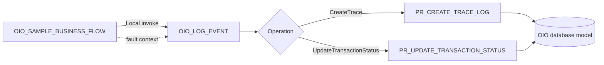
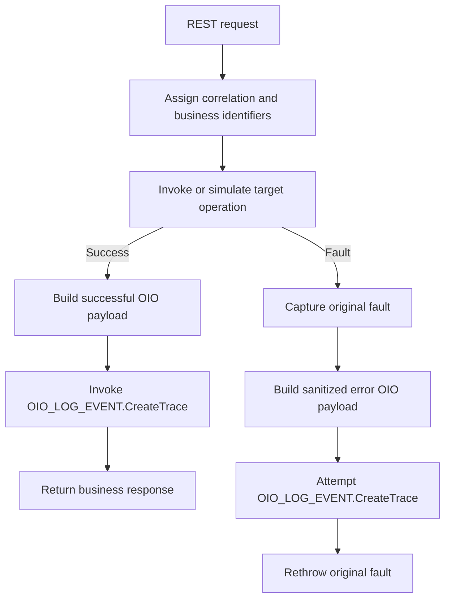

# Oracle Integration implementation

This directory documents the Oracle Integration layer of Oracle Integration Observability (OIO).

The initial implementation uses two application integrations:

| Integration | Role |
|---|---|
| `OIO_LOG_EVENT` | Reusable child integration that validates the requested logging operation and invokes `OIO_OWNER.OIO_TRACE_API` through the Oracle Database Adapter. |
| `OIO_SAMPLE_BUSINESS_FLOW` | Demonstration parent integration that shows success logging, transaction-status updates, and fault logging without coupling the business flow directly to the database package. |

The OIC artifacts are planned for repository version `v0.2`. Until an exported integration archive and end-to-end validation evidence are published, the documents in this directory describe the intended implementation pattern rather than a tested importable asset.

## Design goals

The OIC layer is designed to:

- keep the canonical OIO JSON contract flat;
- centralize database invocation in one reusable integration;
- prevent every business integration from depending directly on the database package;
- support trace creation and transaction-status updates without changing the JSON structure;
- preserve the original business or technical fault when observability logging also fails;
- keep payload persistence optional;
- use a least-privilege database connection;
- allow the sample implementation to be replaced by project-specific business flows.

## Logical flow



`OIO_SAMPLE_BUSINESS_FLOW` represents any parent business integration. Production implementations may have many parent integrations, but they should reuse the same logging child integration or an equivalent shared pattern.

## `OIO_LOG_EVENT`

### Integration type

Recommended implementation:

- Oracle Integration application integration;
- synchronous processing;
- REST Adapter trigger;
- multiple operation entry points configured with a Pick action;
- Oracle Database Adapter invoke;
- callable by co-located parent integrations through the Local Integration adapter.

### Operations

| Operation name | Method | Relative resource | Database procedure |
|---|---|---|---|
| `CreateTrace` | `POST` | `/events` | `OIO_OWNER.OIO_TRACE_API.PR_CREATE_TRACE_LOG` |
| `UpdateTransactionStatus` | `PATCH` | `/events/status` | `OIO_OWNER.OIO_TRACE_API.PR_UPDATE_TRANSACTION_STATUS` |

Both operations accept the same canonical flat field set. The selected operation determines which package procedure is invoked; no additional operation property is added to the OIO JSON contract.

### Responsibilities

`OIO_LOG_EVENT` is responsible for:

1. Receiving the flat OIO payload.
2. Preserving null and optional values according to the logging contract.
3. Serializing the request into the JSON CLOB expected by the package.
4. Invoking the correct database procedure.
5. Returning a simple success response to the parent integration.
6. Propagating a logging fault to the parent so the parent can apply its own failure policy.

It is not responsible for:

- deriving the business meaning of generic attributes;
- deciding which transaction identifiers are relevant;
- retaining every business payload by default;
- replacing native Oracle Integration monitoring;
- retrying indefinitely when the logging database is unavailable;
- logging its own failure by recursively invoking itself.

## `OIO_SAMPLE_BUSINESS_FLOW`

### Purpose

`OIO_SAMPLE_BUSINESS_FLOW` demonstrates how a parent integration can:

- establish a correlation identifier;
- assign business identifiers;
- register an initial or successful trace;
- append a later transaction-status event;
- capture a target-system fault;
- build a sanitized flat error payload;
- invoke `OIO_LOG_EVENT`;
- rethrow the original fault after the logging attempt.

The sample should use anonymized values and one of the integration keys provided by the repository sample data. The `SCM_PO_SYNC` example is a suitable default because a corresponding JSON example already exists under `contracts/examples`.

### Suggested demonstration path



A separate branch or test operation may call `UpdateTransactionStatus` to demonstrate lifecycle events such as `IN_PROGRESS`, `FAILED`, or `RESOLVED`.

## Repository structure

```text
oic/
├── README.md
├── connection-setup.md
├── implementation-pattern.md
├── mapping-reference.md
├── fault-handler-pattern.md
├── exports/
└── screenshots/
```

The `exports` and `screenshots` directories should be added only when sanitized artifacts are available.

## Recommended implementation order

1. Validate the database objects and package in a clean Oracle Database environment.
2. Configure and test the OIO database connection.
3. Create `OIO_LOG_EVENT`.
4. Implement the `CreateTrace` operation.
5. Implement the `UpdateTransactionStatus` operation.
6. Test both operations with the repository JSON examples.
7. Create `OIO_SAMPLE_BUSINESS_FLOW`.
8. Add the fault-handler pattern.
9. Execute end-to-end validation.
10. Export sanitized OIC artifacts and capture screenshots.
11. Update the repository component status from `Planned` to `Tested`.

## Documents

- [Connection setup](connection-setup.md)
- [Implementation pattern](implementation-pattern.md)
- [Mapping reference](mapping-reference.md)
- [Fault-handler pattern](fault-handler-pattern.md)
- [OIO logging contract](../docs/logging-contract.md)
- [OIO architecture](../docs/architecture.md)
- [Flat JSON examples](../contracts/examples/README.md)

## Artifact publication rules

Before publishing an Oracle Integration export or screenshot:

- remove environment-specific host names and URLs;
- remove connection credentials and security artifacts;
- remove production identifiers and payloads;
- replace business data with anonymized examples;
- verify that no tokens, authorization headers, wallets, or certificates are included;
- document the Oracle Integration version and validation date;
- state whether the artifact is illustrative, tested, or production-proven.

## Official Oracle references

- [Receive requests for multiple resources in a single REST Adapter trigger](https://docs.oracle.com/en/cloud/paas/application-integration/integrations-user/expose-multiple-operations-pick-action.html)
- [Invoke a child integration from a parent integration](https://docs.oracle.com/en/cloud/paas/application-integration/integrations-user/invoke-co-located-integration-from-parent-integration-oic.html)
- [Oracle Database Adapter stored-procedure invocation](https://docs.oracle.com/en/cloud/paas/application-integration/database-adapter/invoke-stored-procedure-page.html)
