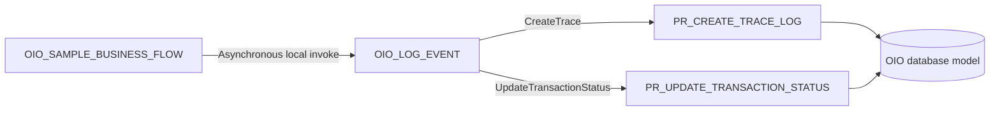

# Oracle Integration implementation

This directory documents the Oracle Integration layer of Oracle Integration Observability (OIO).

## Integrations

| Integration | Role |
|---|---|
| `OIO_LOG_EVENT` | Reusable asynchronous child integration that persists OIO events using a fire-and-forget pattern. |
| `OIO_SAMPLE_BUSINESS_FLOW` | Demonstration parent integration for success, status-update, and fault scenarios. |



The asynchronous handoff prevents database persistence from becoming part of the parent integration's response path. Acceptance of the child request confirms the handoff, not successful database persistence.

The canonical JSON contract remains flat. Its field definitions, mandatory values, payload rules, and database normalization are documented in the [logging contract](../docs/logging-contract.md).

## Current status

The OIC layer is planned for repository version `v0.2`.

Until exported integrations and end-to-end validation evidence are published, the files in this directory describe the intended implementation pattern rather than tested importable artifacts.

| Component | Status |
|---|---|
| OIC connection design | Documented |
| Asynchronous `OIO_LOG_EVENT` design | Documented |
| `OIO_SAMPLE_BUSINESS_FLOW` design | Documented |
| Mapping reference | Documented |
| Fault-handler pattern | Documented |
| OIC exports | Planned |
| Sanitized screenshots | Planned |
| End-to-end validation | Planned |

## Documentation

Read the documents according to the task being performed:

| Document | Use it for |
|---|---|
| [Connection setup](connection-setup.md) | Creating and validating the Oracle Database Adapter connection. |
| [Implementation pattern](implementation-pattern.md) | Building the asynchronous logger and the demonstration parent flow. |
| [Mapping reference](mapping-reference.md) | Mapping the flat contract to the PL/SQL CLOB input. |
| [Fault-handler pattern](fault-handler-pattern.md) | Dispatching an error event without replacing the original fault. |
| [Logging contract](../docs/logging-contract.md) | Canonical field definitions and operation rules. |
| [Architecture](../docs/architecture.md) | Overall OIO architecture and component responsibilities. |
| [JSON examples](../contracts/examples/README.md) | Example create and status-update payloads. |

## Recommended implementation order

1. Validate the database objects and package.
2. Configure the `OIO_DB` connection.
3. Build `OIO_LOG_EVENT` as an asynchronous one-way integration.
4. Test both logger operations independently.
5. Build `OIO_SAMPLE_BUSINESS_FLOW`.
6. Validate the asynchronous handoff and the fault path.
7. Execute end-to-end tests, including delayed persistence and child failure scenarios.
8. Publish sanitized exports and screenshots.
9. Record the tested Oracle Integration and database versions.

## Artifact publication

Before publishing an export or screenshot:

- remove credentials, tokens, wallets, certificates, private endpoints, and environment-specific identifiers;
- replace business data with anonymized examples;
- follow the repository [security considerations](../README.md#security-considerations);
- document the artifact status as illustrative, tested, or production-proven.

## Planned artifact structure

```text
oic/
├── README.md
├── connection-setup.md
├── implementation-pattern.md
├── mapping-reference.md
├── fault-handler-pattern.md
├── exports/
└── screenshots/
```
