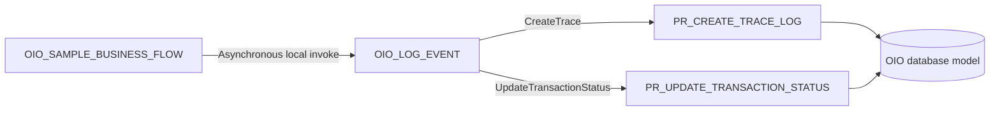

# Oracle Integration implementation

This directory contains the Oracle Integration layer of Oracle Integration Observability (OIO).

## Integrations

| Integration | Role | v1 artifact |
|---|---|---|
| `OIO_LOG_EVENT` | Reusable asynchronous child integration that persists OIO events using a fire-and-forget pattern. | [`OIO_LOG_EVENT_01.00.0000.iar`](export/OIO_LOG_EVENT_01.00.0000.iar) |
| `OIO_SAMPLE_BUSINESS_FLOW` | Demonstration parent integration for success, status-update, and fault scenarios. | [`OIO_SAMPLE_BUSINESS_FLOW_01.00.0000.iar`](export/OIO_SAMPLE_BUSINESS_FLOW_01.00.0000.iar) |



The asynchronous handoff keeps database persistence outside the parent integration's response path. Acceptance of the child request confirms the handoff, not successful database persistence.

The canonical JSON contract remains flat. Field definitions, required values, payload rules, and database behavior are defined in the [logging contract](../docs/logging-contract.md).

## v1 status

| Component | Status |
|---|---|
| Oracle Database Adapter connection design | Documented |
| `OIO_LOG_EVENT` | Implemented; sanitized IAR published |
| `OIO_SAMPLE_BUSINESS_FLOW` | Implemented; sanitized IAR published |
| Mapping reference | Documented |
| Fault-handler pattern | Documented |
| Sanitized screenshots | Published under [`oic/screenshot/`](screenshot/) |
| Clean-environment end-to-end validation evidence | Not yet published |

The implementation is complete for the v1 reference scope. Environment-specific validation remains required before production adoption or a tagged tested release.

## Documentation

| Document | Source of truth for |
|---|---|
| [Connection setup](connection-setup.md) | Oracle Database Adapter connection, runtime account, procedure discovery, and invoke metadata. |
| [Implementation pattern](implementation-pattern.md) | OIC runtime flow, asynchronous semantics, parent/child behavior, and validation. |
| [Mapping reference](mapping-reference.md) | Field mapping and JSON serialization. |
| [Fault-handler pattern](fault-handler-pattern.md) | Preserving the original fault while dispatching observability events. |
| [Logging contract](../docs/logging-contract.md) | Canonical field definitions, validation, matching, and database procedure behavior. |
| [Architecture](../docs/architecture.md) | Overall OIO architecture, scope, and security boundaries. |
| [JSON examples](../contracts/examples/README.md) | Anonymized create and status-update payloads. |

## Deployment and validation order

1. Install and validate the database objects and `OIO_TRACE_API`.
2. Configure the `OIO_TRACE_DB` connection.
3. Import and activate `OIO_LOG_EVENT`.
4. Validate `CreateTrace` and `UpdateTransactionStatus` independently.
5. Import and activate `OIO_SAMPLE_BUSINESS_FLOW`.
6. Validate success, business-error, technical-error, handoff-failure, and child-runtime-failure scenarios.
7. Compare the parent instance, child instance, and resulting OIO database records.
8. Record the tested Oracle Integration and database versions and the validation date.

Any replacement export or screenshot must follow the repository [security considerations](../README.md#security-considerations) and remain free of credentials, private endpoints, and production-sensitive data.

## Directory structure

```text
oic/
├── README.md
├── connection-setup.md
├── implementation-pattern.md
├── mapping-reference.md
├── fault-handler-pattern.md
├── export/
└── screenshot/
```
