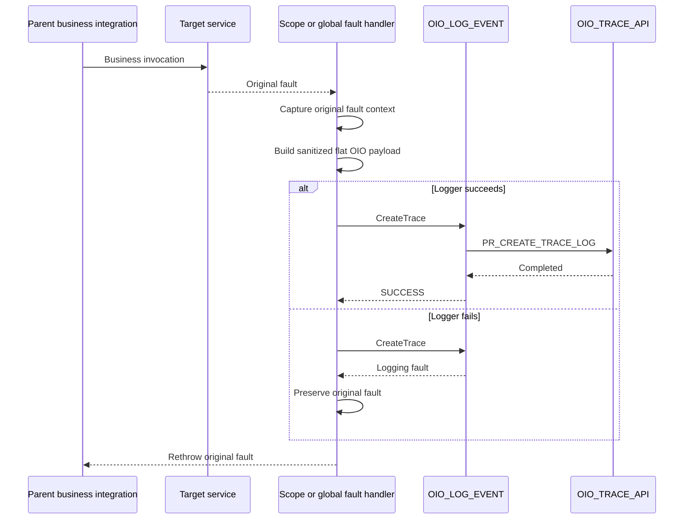

# OIO fault-handler pattern

## 1. Purpose

This document describes how a parent Oracle Integration flow should register an error with `OIO_LOG_EVENT` while preserving the original business or technical fault.

The governing rule is:

> A logging failure must not replace or hide the original business or technical fault.

The pattern applies to `OIO_SAMPLE_BUSINESS_FLOW` and can be adopted by production parent integrations.

## 2. Scope and global handlers

OIO can be invoked from:

- a scope fault handler when the error belongs to a specific business step;
- a global fault handler when the integration needs a final common error path;
- an explicit business-error branch before a technical fault is thrown;
- a retry or reprocessing flow that appends a new transaction status.

Prefer a scope fault handler when it can provide more precise context, such as the failed target operation or current business step. Use a global handler for final integration-level handling and errors not addressed by a more specific scope.

## 3. Available fault context

Oracle Integration provides fault functions that can be used in the Expression Builder, including:

```text
getFaultAsString()
getFaultAsXML()
getFaultName()
getFaultedActionName()
getFlowId()
```

These values are diagnostic inputs. They must be reviewed and sanitized before persistence.

Suggested use:

| Function | OIO use |
|---|---|
| `getFlowId()` | `oicInstanceId` |
| `getFaultName()` | Candidate `errorCode` |
| `getFaultedActionName()` | Optional summary or configured attribute |
| `getFaultAsString()` | Candidate source for a sanitized `errorMessage` |
| `getFaultAsXML()` | Optional source for a reduced diagnostic payload |

Do not automatically store the complete fault XML or string in a CLOB.

## 4. Main pattern



## 5. Handler implementation steps

### Step 1: capture the original fault

Before invoking the logger, assign the original fault values to variables that will not be replaced by a later logger fault.

Capture only the values needed for:

- rethrowing the original fault;
- producing a concise OIO summary;
- deriving an error code;
- identifying the failed action;
- creating an approved diagnostic representation.

### Step 2: preserve business context

The handler should retain the business values assigned before the failing invoke:

```text
integrationKey
correlationId
transactionId1
transactionId2
transactionId3
attr1Value through attr10Value
```

Do not depend on fault text to reconstruct business identifiers.

### Step 3: build the flat error payload

Recommended values:

```text
logLevel = E
transactionStatus = FAILED
```

Example:

```json
{
  "integrationKey": "SCM_PO_SYNC",
  "correlationId": "REQ-20260805-00041",
  "oicInstanceId": "987654321001",
  "userName": "OIC",
  "logLevel": "E",
  "summary": "Purchase order synchronization failed at the target invocation.",
  "errorCode": "TARGET_INVOCATION_FAULT",
  "errorMessage": "The target service was unavailable.",
  "attr1Value": "PO-100045",
  "attr2Value": "SOURCE-REQ-8841",
  "attr3Value": null,
  "attr4Value": null,
  "attr5Value": null,
  "attr6Value": null,
  "attr7Value": null,
  "attr8Value": null,
  "attr9Value": null,
  "attr10Value": null,
  "transactionId1": "PO-100045",
  "transactionId2": "SOURCE-REQ-8841",
  "transactionId3": "SYNC-BATCH-20260805-01",
  "transactionStatus": "FAILED",
  "requestPayload": null,
  "responsePayload": null
}
```

The error code and message above are illustrative. The actual mapping should use approved error-classification rules.

### Step 4: sanitize diagnostic content

Before assigning fault content:

- remove access tokens and authorization headers;
- remove credentials, private keys, and connection strings;
- mask personal, financial, and regulated data;
- avoid complete stack traces when a short diagnostic description is sufficient;
- avoid raw request and response bodies unless retention was reviewed and approved;
- respect country-specific privacy and retention requirements;
- retain only what is necessary for support.

### Step 5: invoke `OIO_LOG_EVENT`

Use:

```text
OIO_LOG_EVENT.CreateTrace
```

Place this call inside a nested scope or equivalent error boundary so a logging fault can be handled separately from the original target fault.

### Step 6: handle a logger fault

When the logger fails:

- do not overwrite the stored original fault variables;
- do not call `OIO_LOG_EVENT` again from its own error path;
- do not enter an unbounded retry loop;
- optionally write a native OIC tracking note or approved notification;
- apply only the fallback behavior approved by the project;
- continue to the original-fault rethrow path.

A logger failure may justify an operational alert, but it must not masquerade as the original business failure.

### Step 7: rethrow the original fault

After the logging attempt, use a rethrow action or the project's approved error response pattern to preserve the original business or technical outcome.

The parent integration should not return success merely because the error was recorded.

## 6. Business errors

Not every business error arrives as an adapter fault.

Examples:

- failed validation;
- rejected transaction;
- duplicate business document;
- missing mandatory reference data;
- approval denied.

For an explicit business-error branch:

1. Build the error payload.
2. Use `logLevel = E`.
3. Set a meaningful business status such as `REJECTED` or `FAILED`.
4. Invoke `OIO_LOG_EVENT.CreateTrace` or append a status update, depending on whether the trace already exists.
5. Return or throw the business error expected by the caller.

Do not convert every business rejection into a generic technical fault.

## 7. Existing trace versus new trace

Use `CreateTrace` when:

- no OIO master trace exists for the business transaction;
- the error is the first persisted event in the OIO lifecycle;
- the flow is creating the initial observability record.

Use `UpdateTransactionStatus` when:

- the trace was created earlier;
- the transaction identifiers can locate it reliably;
- the new error or recovery state is part of the same lifecycle.

Example:

```text
RECEIVED -> IN_PROGRESS -> FAILED -> RESOLVED
```

The repository's current status-update procedure may affect multiple traces if the provided identifier combination is not unique.

## 8. Retry behavior

Retry policy must be explicit.

Consider separately:

- retrying the original target operation;
- retrying the logger invocation;
- appending a later OIO status event;
- reprocessing the business transaction.

Do not let logging retries significantly delay or multiply a failing business transaction without an approved design.

When a business retry succeeds, append a status such as `RESOLVED` only if that status is part of the documented lifecycle for the integration.

## 9. Avoid recursive logging

`OIO_LOG_EVENT` must not invoke itself from its own global fault handler.

A recursive pattern can cause:

- repeated database calls;
- duplicate events;
- increased load during an outage;
- loss of the original fault context;
- difficult-to-diagnose loops.

The logger's own failure path should use native OIC monitoring and an approved external operational mechanism when necessary.

## 10. Validation scenarios

### Technical target fault

- [ ] Target invoke fails.
- [ ] Original fault values are captured.
- [ ] OIO receives `logLevel = E`.
- [ ] The OIO row contains business identifiers.
- [ ] The original target fault is rethrown.

### Business validation error

- [ ] Business error code is preserved.
- [ ] Business status is meaningful.
- [ ] Error is not mislabeled as infrastructure failure.
- [ ] Caller receives the expected business response.

### Logger database failure

- [ ] OIO database invoke fails.
- [ ] No recursive logger call occurs.
- [ ] Original target fault remains available.
- [ ] Parent rethrows the original fault.
- [ ] Native OIC monitoring shows the logger failure context.

### Sensitive payload

- [ ] Full payload retention is disabled by default.
- [ ] Sanitized diagnostic content is used when approved.
- [ ] No token, credential, bank detail, or unnecessary personal data is stored.
- [ ] Retention and deletion requirements are documented.

## 11. Documentation evidence to publish

When this pattern is implemented, add sanitized screenshots showing:

- the parent business scope;
- the scope or global fault handler;
- original-fault variable assignments;
- the flat OIO error mapping;
- the local invocation of `OIO_LOG_EVENT`;
- the nested logger-fault boundary;
- the rethrow action;
- the resulting OIO event row.

Do not publish production payloads or connection details.

## 12. Official Oracle references

- [Add global fault handling to integrations](https://docs.oracle.com/en/cloud/paas/application-integration/integrations-user/add-global-faults-orchestrated-integrations.html)
- [Error-handling actions, including rethrow](https://docs.oracle.com/en/cloud/paas/application-integration/integrations-user/error-handling-category.html)
- [Invoke a child integration from a parent integration](https://docs.oracle.com/en/cloud/paas/application-integration/integrations-user/invoke-co-located-integration-from-parent-integration-oic.html)
