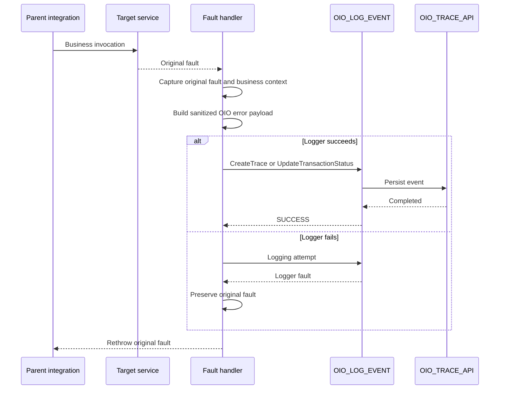

# OIO fault-handler pattern

## 1. Purpose

This document is the source of truth for registering an error in OIO while preserving the original Oracle Integration fault.

The governing rule is:

> A logging failure must not replace or hide the original business or technical fault.

Contract fields are defined in the [logging contract](../docs/logging-contract.md), and their OIC mapping is defined in the [mapping reference](mapping-reference.md).

## 2. Handler placement

Invoke OIO from:

- a scope fault handler when the failing business step requires precise context;
- a global fault handler for final integration-level handling;
- an explicit business-error branch when no adapter fault is raised;
- a retry or reprocessing flow when appending a later status event.

Prefer the narrowest handler that still has the required business context.

## 3. Fault context

Oracle Integration fault functions may provide diagnostic values such as:

```text
getFaultAsString()
getFaultAsXML()
getFaultName()
getFaultedActionName()
getFlowId()
```

Suggested use:

| Function | OIO use |
|---|---|
| `getFlowId()` | `oicInstanceId` |
| `getFaultName()` | Candidate `errorCode` |
| `getFaultedActionName()` | Failed-step context |
| `getFaultAsString()` | Source for a sanitized `errorMessage` |
| `getFaultAsXML()` | Optional source for a reduced diagnostic payload |

These values are diagnostic inputs, not content that should automatically be persisted in full.

## 4. Core pattern



## 5. Implementation steps

### 5.1 Capture the original fault

Before invoking the logger, assign the original fault values to variables that will not be overwritten by a later logger fault.

Capture only what is required to:

- rethrow the original fault;
- identify the failed action;
- derive a concise error code and message;
- build an approved diagnostic representation.

### 5.2 Preserve business context

Business identifiers and configured attributes should already be available before the failing invoke.

Do not attempt to reconstruct transaction identifiers from the fault text.

### 5.3 Build the OIO error payload

Typical values are:

```text
logLevel = E
transactionStatus = FAILED
```

Choose between:

```text
OIO_LOG_EVENT.CreateTrace
OIO_LOG_EVENT.UpdateTransactionStatus
```

Use `CreateTrace` when no OIO master trace exists. Use `UpdateTransactionStatus` when the transaction already has a trace and the supplied identifiers can locate it reliably.

The exact field definitions and mandatory values are maintained in the [logging contract](../docs/logging-contract.md).

### 5.4 Sanitize diagnostic content

Before persistence:

- remove credentials, tokens, authorization headers, and connection strings;
- mask personal, financial, confidential, and regulated data;
- retain only the diagnostic content required for support;
- follow the repository [security considerations](../README.md#security-considerations).

Payload persistence is optional.

### 5.5 Invoke the logger inside a separate error boundary

Place the call to `OIO_LOG_EVENT` inside a nested scope or equivalent boundary so that a logger fault can be handled independently.

Do not invoke `OIO_LOG_EVENT` again from that logger-fault path.

### 5.6 Handle a logger fault

When the logging call fails:

1. Keep the stored original fault unchanged.
2. Do not enter an unbounded retry loop.
3. Optionally create an approved native OIC tracking note or external operational notification.
4. Continue to the original-fault outcome.

A logger failure may require an alert, but it must not become the fault returned in place of the original business failure.

### 5.7 Rethrow the original fault

After the logging attempt, use the project's approved rethrow or error-response pattern.

The parent integration must not return success merely because the fault was recorded.

## 6. Business errors

Business validation failures may occur without an adapter fault.

For an explicit business-error branch:

1. Assign a meaningful business error code and status.
2. Build the OIO error payload.
3. Create the trace or append a status event.
4. Return or throw the expected business error.

Do not classify every rejected transaction as an infrastructure failure.

## 7. Retry and recovery

Treat these decisions separately:

- retrying the target operation;
- retrying the logger call;
- reprocessing the business transaction;
- appending a later recovery status.

Avoid retry behavior that multiplies database calls or significantly delays the original transaction without an approved design.

When a later retry succeeds, append a business-defined recovery status such as `RESOLVED` only when it belongs to that integration's documented lifecycle.

## 8. Prevent recursive logging

`OIO_LOG_EVENT` must not call itself from its own fault handler.

Recursive logging can cause duplicate events, increased load during an outage, loops, and loss of the original context. The logger's own failure should rely on native OIC monitoring and an approved operational notification mechanism.

## 9. Validation scenarios

### Target technical fault

- [ ] The target invoke fails.
- [ ] The original fault is captured.
- [ ] Business identifiers remain available.
- [ ] OIO receives an error event.
- [ ] The original target fault is rethrown.

### Business validation error

- [ ] The business code and status are preserved.
- [ ] The error is not mislabeled as an infrastructure failure.
- [ ] The caller receives the expected business outcome.

### Logger failure

- [ ] The database or mapping call fails.
- [ ] No recursive logger call occurs.
- [ ] The original target fault remains available.
- [ ] The parent returns or rethrows the original fault.

### Sensitive content

- [ ] Payload retention is disabled by default.
- [ ] Any retained content is minimized and sanitized.
- [ ] Applicable privacy and retention decisions are documented.

## 10. Evidence to publish

After implementation, add sanitized screenshots showing:

- the parent business scope;
- the fault handler;
- original-fault variable assignments;
- the OIO logger invocation;
- the nested logger-fault boundary;
- the rethrow action;
- the resulting OIO database event.

Do not publish production payloads or connection details.

## 11. Related documentation

- [Implementation pattern](implementation-pattern.md)
- [Mapping reference](mapping-reference.md)
- [Logging contract](../docs/logging-contract.md)
- [Security considerations](../README.md#security-considerations)

## 12. Official Oracle references

- [Add global fault handling to integrations](https://docs.oracle.com/en/cloud/paas/application-integration/integrations-user/add-global-faults-orchestrated-integrations.html)
- [Error-handling actions, including rethrow](https://docs.oracle.com/en/cloud/paas/application-integration/integrations-user/error-handling-category.html)
- [Invoke a child integration from a parent integration](https://docs.oracle.com/en/cloud/paas/application-integration/integrations-user/invoke-co-located-integration-from-parent-integration-oic.html)
