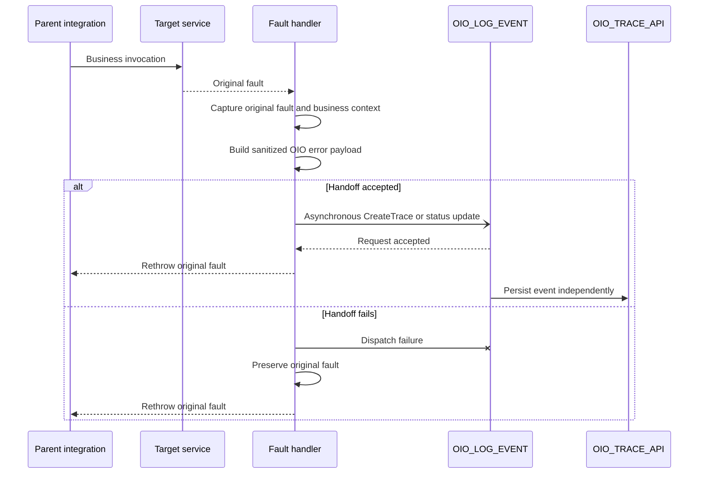

# OIO fault-handler pattern

## 1. Purpose

This document is the source of truth for dispatching an OIO error event asynchronously while preserving the original Oracle Integration fault.

The governing rule is:

> An observability handoff failure must not replace or hide the original business or technical fault.

`OIO_LOG_EVENT` is fire-and-forget. A successful handoff does not confirm that the event was persisted; runtime failures after acceptance belong to the child integration instance.

Contract fields are defined in the [logging contract](../docs/logging-contract.md), and their OIC mapping is defined in the [mapping reference](mapping-reference.md).

## 2. Handler placement

Invoke OIO from:

- a scope fault handler when the failing business step requires precise context;
- a global fault handler for final integration-level handling;
- an explicit business-error branch when no adapter fault is raised;
- a retry or reprocessing flow when appending a later status event.

Prefer the narrowest handler that still has the required business context.

## 3. Fault context

Oracle Integration fault functions may provide diagnostic values such as:

```text
getFaultAsString()
getFaultAsXML()
getFaultName()
getFaultedActionName()
getFlowId()
```

Suggested use:

| Function | OIO use |
|---|---|
| `getFlowId()` | `oicInstanceId` |
| `getFaultName()` | Candidate `errorCode` |
| `getFaultedActionName()` | Failed-step context |
| `getFaultAsString()` | Source for a sanitized `errorMessage` |
| `getFaultAsXML()` | Optional source for a reduced diagnostic payload |

These values are diagnostic inputs, not content that should automatically be persisted in full.

## 4. Asynchronous fault pattern



There are two different failure moments:

1. **Dispatch or handoff failure:** the parent cannot submit the asynchronous child request. This can be handled inside the parent fault path.
2. **Child runtime failure:** the request was accepted, but mapping, database, or PL/SQL processing later fails. This is isolated in the child instance and cannot be returned to the already continued parent.

## 5. Implementation steps

### 5.1 Capture the original fault

Before invoking the logger, assign the original fault values to variables that will not be overwritten by a dispatch failure.

Capture only what is required to:

- rethrow the original fault;
- identify the failed action;
- derive a concise error code and message;
- build an approved diagnostic representation.

### 5.2 Preserve business context

Business identifiers and configured attributes should already be available before the failing invoke.

Do not attempt to reconstruct transaction identifiers from the fault text.

### 5.3 Build the OIO error payload

Typical values are:

```text
logLevel = E
transactionStatus = FAILED
```

Choose between:

```text
OIO_LOG_EVENT.CreateTrace
OIO_LOG_EVENT.UpdateTransactionStatus
```

Use `CreateTrace` when no OIO master trace exists. Use `UpdateTransactionStatus` when the transaction already has a trace and the supplied identifiers can locate it reliably.

The exact field definitions and mandatory values are maintained in the [logging contract](../docs/logging-contract.md).

### 5.4 Sanitize diagnostic content

Before dispatch:

- remove credentials, tokens, authorization headers, and connection strings;
- mask personal, financial, confidential, and regulated data;
- retain only the diagnostic content required for support;
- follow the repository [security considerations](../README.md#security-considerations).

Payload persistence is optional.

### 5.5 Dispatch the asynchronous logger

Invoke `OIO_LOG_EVENT` using the asynchronous local integration operation.

The parent waits only for Oracle Integration to accept or reject the handoff. It does not wait for the Database Adapter or package execution.

### 5.6 Handle a handoff failure

Place the asynchronous invoke inside a narrow error boundary when the design needs to distinguish dispatch failure from the original target fault.

If dispatch fails:

1. Keep the stored original fault unchanged.
2. Do not call the logger recursively.
3. Optionally use an approved native tracking note or external notification.
4. Continue to the original-fault outcome.

### 5.7 Rethrow the original fault

After the handoff attempt, use the project's approved rethrow or error-response pattern.

The parent must not wait for OIO persistence and must not return success merely because the logging request was accepted.

## 6. Child runtime failures

After acceptance, child failures are operational concerns of `OIO_LOG_EVENT`.

Monitor and manage them through:

- OIC child instance monitoring;
- recoverable-instance handling or resubmission where appropriate;
- alerts for repeated database or package failures;
- reconciliation between expected business events and OIO rows when required.

The parent business instance has already continued and cannot receive these downstream failures.

## 7. Business errors

Business validation failures may occur without an adapter fault.

For an explicit business-error branch:

1. Assign a meaningful business error code and status.
2. Build the OIO error payload.
3. Dispatch a create or status-update event asynchronously.
4. Return or throw the expected business error without waiting for OIO persistence.

Do not classify every rejected transaction as an infrastructure failure.

## 8. Retry and recovery

Treat these decisions separately:

- retrying the target operation;
- retrying a failed handoff;
- recovering or resubmitting the asynchronous child instance;
- reprocessing the business transaction;
- appending a later recovery status.

Do not automatically retry the logger from its own fault path. Avoid patterns that create duplicate events or unbounded loops.

When a later business retry succeeds, append a business-defined recovery status such as `RESOLVED` only when it belongs to that integration's documented lifecycle.

## 9. Prevent recursive logging

`OIO_LOG_EVENT` must not call itself from its own fault handler.

Recursive logging can cause duplicate events, increased load during an outage, loops, and loss of the original context. The logger's own failure should rely on native OIC monitoring and an approved operational notification mechanism.

## 10. Validation scenarios

### Target technical fault with accepted handoff

- [ ] The target invoke fails.
- [ ] The original fault is captured.
- [ ] The OIO request is accepted asynchronously.
- [ ] The original target fault is rethrown without waiting for the child.
- [ ] The child eventually persists the event.

### Handoff failure

- [ ] The asynchronous child cannot be invoked or accepted.
- [ ] The original target fault remains available.
- [ ] The parent returns or rethrows the original fault.
- [ ] No recursive logging occurs.

### Child runtime failure

- [ ] The handoff is accepted.
- [ ] The parent completes independently.
- [ ] The child fails during mapping, database, or package execution.
- [ ] The child failure is visible in OIC monitoring.
- [ ] The missing OIO row can be detected operationally when required.

### Business validation error

- [ ] The business code and status are preserved.
- [ ] The error is not mislabeled as an infrastructure failure.
- [ ] The parent returns the expected business outcome without waiting for persistence.

### Sensitive content

- [ ] Payload retention is disabled by default.
- [ ] Any retained content is minimized and sanitized.
- [ ] Applicable privacy and retention decisions are documented.

## 11. Evidence to publish

After implementation, add sanitized screenshots showing:

- the parent business scope;
- the fault handler;
- original-fault variable assignments;
- the asynchronous local invoke;
- the handoff-failure boundary;
- the rethrow action;
- separate parent and child instances;
- the resulting OIO database event or child failure.

Do not publish production payloads or connection details.

## 12. Related documentation

- [Implementation pattern](implementation-pattern.md)
- [Mapping reference](mapping-reference.md)
- [Logging contract](../docs/logging-contract.md)
- [Security considerations](../README.md#security-considerations)

## 13. Official Oracle references

- [Configure a REST Adapter trigger to work asynchronously](https://docs.oracle.com/en/cloud/paas/application-integration/rest-adapter/configure-rest-trigger-that-works-asynchronously.html)
- [Differences between synchronous and asynchronous integrations](https://docs.oracle.com/en/cloud/paas/application-integration/integrations-user/differences-between-asynchronous-synchronous-integrations.html)
- [Add global fault handling to integrations](https://docs.oracle.com/en/cloud/paas/application-integration/integrations-user/add-global-faults-orchestrated-integrations.html)
- [Error-handling actions, including rethrow](https://docs.oracle.com/en/cloud/paas/application-integration/integrations-user/error-handling-category.html)
- [Invoke a child integration from a parent integration](https://docs.oracle.com/en/cloud/paas/application-integration/integrations-user/invoke-co-located-integration-from-parent-integration-oic.html)
