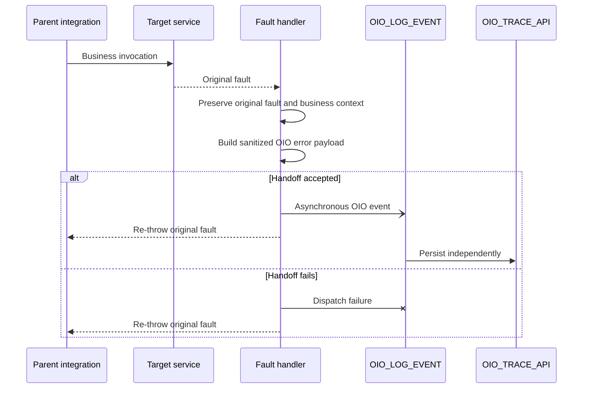

# OIO fault-handler pattern

## 1. Purpose

This document is the source of truth for dispatching an OIO error event without replacing the original Oracle Integration fault.

> An observability handoff failure must not replace or hide the original business or technical fault.

`OIO_LOG_EVENT` is asynchronous. Acceptance confirms the handoff only; persistence failures after acceptance belong to the child instance.

Contract fields are defined in the [logging contract](../docs/logging-contract.md), and OIC field mapping is defined in the [mapping reference](mapping-reference.md).

## 2. Handler placement

Use the narrowest fault boundary that still has the required business context:

- scope fault handler for failures that need step-specific context;
- global fault handler for final integration-level handling;
- explicit business-error branch when no adapter fault is raised;
- retry or reprocessing flow when appending a later status event.

## 3. Fault context

Oracle Integration fault functions can provide diagnostic values such as:

| Function | OIO use |
|---|---|
| `getFlowId()` | `oicInstanceId` |
| `getFaultName()` | Candidate `errorCode` |
| `getFaultedActionName()` | Failed-step context |
| `getFaultAsString()` | Source for a sanitized `errorMessage` |
| `getFaultAsXML()` | Optional source for a reduced diagnostic payload |

Treat these values as diagnostic inputs. Do not persist complete fault content automatically.

## 4. Fault sequence

Two failure moments must remain distinct:

1. **Handoff failure:** the parent cannot submit or complete acceptance of the asynchronous child request. The parent can handle this locally while preserving the original target fault.
2. **Child runtime failure:** the request was accepted but mapping, Database Adapter, or PL/SQL processing later fails. The failure remains on the child instance and cannot be returned to a parent that already continued.

## 5. Implementation rules

1. Capture the original fault before invoking the logger so a handoff failure cannot overwrite its context.
2. Preserve business identifiers independently of fault text; do not reconstruct transaction IDs from diagnostic messages.
3. Build an error event with business-defined status and `logLevel = E`.
4. Use `CreateTrace` when no OIO master trace exists; use `UpdateTransactionStatus` only when the existing trace can be identified reliably.
5. Sanitize error text and optional payload content before dispatch.
6. Invoke `OIO_LOG_EVENT` asynchronously; do not wait for database persistence.
7. After the handoff attempt, use the integration's approved Re-throw Fault or business-error response pattern so the original outcome is preserved.

For field requirements and update matching, follow the [logging contract](../docs/logging-contract.md).

## 6. Handoff and logger failures

If the asynchronous handoff fails:

- keep the captured original fault unchanged;
- do not invoke the logger recursively;
- optionally record the dispatch problem through an approved native tracking or notification mechanism;
- continue with the original-fault outcome.

If `OIO_LOG_EVENT` fails after acceptance, use native Oracle Integration monitoring, recovery/resubmission where appropriate, and operational reconciliation when missing OIO records matter.

The logger must never call itself from its own fault handler. Recursive logging can create duplicate events, loops, and additional load during an outage.

## 7. Business errors and recovery

Business validation failures may occur without an adapter fault. Record them with meaningful business codes/statuses and preserve the expected business response; do not classify every rejected transaction as an infrastructure failure.

Treat target retry, handoff retry, child recovery, business reprocessing, and later status updates as separate decisions. Avoid automatic logger retries that can create duplicates or unbounded loops.

A later recovery status such as `RESOLVED` is valid only when it belongs to the integration's documented business lifecycle.

## 8. Data protection

Before dispatching an error event:

- remove credentials, tokens, authorization headers, connection strings, and private endpoint details;
- mask personal, financial, confidential, or regulated data;
- retain only the diagnostic content required for support;
- leave optional payload fields unset unless retention is explicitly approved.

Follow the repository [security considerations](../README.md#security-considerations).

## 9. Validation checklist

- [ ] The original target fault is captured before the OIO handoff.
- [ ] Business identifiers are available independently of the fault text.
- [ ] Error content is sanitized before dispatch.
- [ ] The OIO request is asynchronous.
- [ ] An accepted handoff does not make the parent wait for persistence.
- [ ] A handoff failure does not replace the original fault.
- [ ] A child runtime failure remains visible on the child instance.
- [ ] Business validation errors preserve their business meaning.
- [ ] `OIO_LOG_EVENT` does not recursively invoke itself.
- [ ] Optional payload retention is explicitly controlled.

## 10. Related documentation

- [Implementation pattern](implementation-pattern.md)
- [Mapping reference](mapping-reference.md)
- [Logging contract](../docs/logging-contract.md)
- [Security considerations](../README.md#security-considerations)

## 11. Official Oracle references

- [Configure a REST Adapter trigger to work asynchronously](https://docs.oracle.com/en/cloud/paas/application-integration/rest-adapter/configure-rest-trigger-that-works-asynchronously.html)
- [Differences between synchronous and asynchronous integrations](https://docs.oracle.com/en/cloud/paas/application-integration/integrations-user/differences-between-asynchronous-synchronous-integrations.html)
- [Add global fault handling to integrations](https://docs.oracle.com/en/cloud/paas/application-integration/integrations-user/add-global-faults-orchestrated-integrations.html)
- [Error-handling actions, including Re-throw Fault and Throw New Fault](https://docs.oracle.com/en/cloud/paas/application-integration/integrations-user/error-handling-category.html)
- [Invoke a child integration from a parent integration](https://docs.oracle.com/en/cloud/paas/application-integration/integrations-user/invoke-co-located-integration-from-parent-integration-oic.html)
