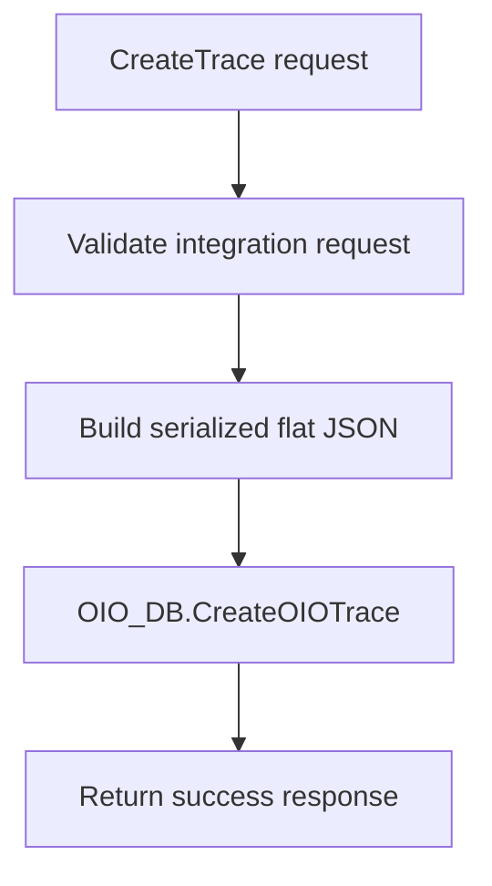
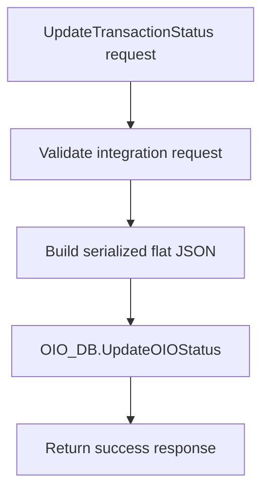
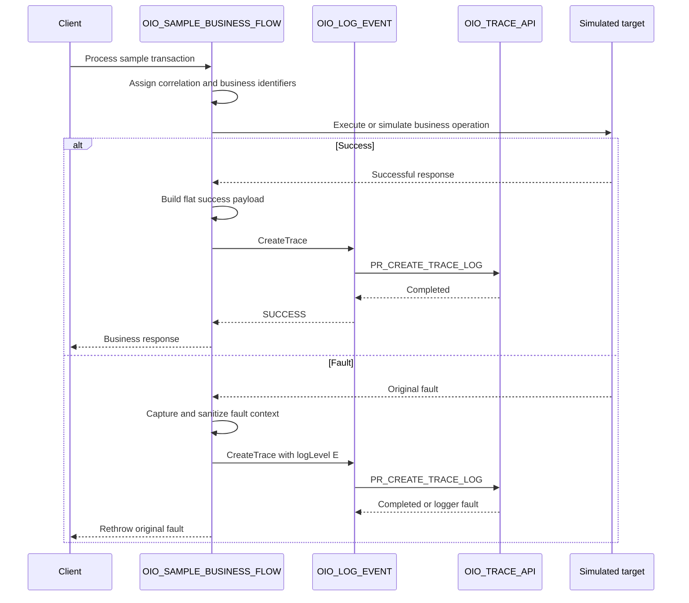

# OIO Oracle Integration implementation pattern

## 1. Purpose

This document describes the planned implementation of the two Oracle Integration flows used by the OIO reference implementation:

```text
OIO_LOG_EVENT
OIO_SAMPLE_BUSINESS_FLOW
```

The implementation preserves the repository's flat JSON contract and delegates database normalization to `OIO_OWNER.OIO_TRACE_API`.

## 2. Integration inventory

| Integration | Pattern | Processing | Responsibility |
|---|---|---|---|
| `OIO_LOG_EVENT` | Application integration | Synchronous | Reusable logging child integration |
| `OIO_SAMPLE_BUSINESS_FLOW` | Application integration | Synchronous | Parent integration used to demonstrate the OIO pattern |

Recommended initial version:

```text
01.00.0000
```

The actual version may follow the implementing organization's deployment convention.

## 3. `OIO_LOG_EVENT`

### 3.1 Trigger design

Use a REST Adapter trigger configured with multiple operations and a Pick action.

| Operation | Method | Resource |
|---|---|---|
| `CreateTrace` | `POST` | `/events` |
| `UpdateTransactionStatus` | `PATCH` | `/events/status` |

Both operations use the canonical field set defined in `docs/logging-contract.md`.

The operation is selected by the resource and HTTP verb. The JSON payload remains flat and does not receive an additional routing property.

### 3.2 Create trace branch



Recommended steps:

1. Receive the flat request.
2. Validate that the required create fields are present.
3. Serialize the complete request as JSON text.
4. Map the JSON text to `P_PAYLOAD`.
5. Invoke `OIO_TRACE_API.PR_CREATE_TRACE_LOG`.
6. Return a simple success response.

The database package remains the authoritative validator. OIC validation is intended to fail fast and improve the caller experience, not to duplicate every package rule.

Suggested response:

```json
{
  "status": "SUCCESS",
  "operation": "CreateTrace",
  "message": "OIO trace event registered."
}
```

### 3.3 Update transaction status branch



Recommended steps:

1. Receive the flat status-update request.
2. Validate `integrationKey`.
3. Validate `transactionStatus`.
4. Confirm that at least one transaction identifier is present.
5. Serialize the complete request as JSON text.
6. Map the JSON text to `P_PAYLOAD`.
7. Invoke `OIO_TRACE_API.PR_UPDATE_TRANSACTION_STATUS`.
8. Return a simple success response.

Suggested response:

```json
{
  "status": "SUCCESS",
  "operation": "UpdateTransactionStatus",
  "message": "OIO transaction status event registered."
}
```

The package may update more than one trace when the submitted identifiers are not unique. The parent integration must provide a sufficiently selective identifier combination.

### 3.4 Validation behavior

Recommended OIC request validations:

#### Create trace

```text
integrationKey
oicInstanceId
logLevel
summary
attr1Value
transactionStatus
```

#### Update status

```text
integrationKey
transactionStatus
at least one of transactionId1, transactionId2, transactionId3
```

The definitive rules remain documented in `docs/logging-contract.md` and implemented in the package.

### 3.5 Error behavior

`OIO_LOG_EVENT` must not attempt to log its own database or mapping failures by invoking itself.

On failure:

1. Preserve the adapter or mapping fault.
2. Return or propagate the fault to the parent integration.
3. Let the parent decide whether to continue, return a warning, retry, or rethrow its original fault.
4. Avoid an unbounded retry loop.
5. Avoid replacing a business-flow fault with a logger fault.

## 4. `OIO_SAMPLE_BUSINESS_FLOW`

### 4.1 Trigger

A REST trigger is recommended for easy testing.

Suggested operation:

| Operation | Method | Resource |
|---|---|---|
| `ProcessSampleTransaction` | `POST` | `/sample/transactions` |

A simple request can include:

```json
{
  "transactionId": "PO-100045",
  "sourceSystem": "EXTERNAL_PROCUREMENT",
  "simulateError": false
}
```

This request belongs only to the sample business flow. It is not the OIO logging contract.

### 4.2 Main flow



### 4.3 Sample integration configuration

The demonstration may use:

```text
integrationKey = SCM_PO_SYNC
```

Suggested transaction mapping:

| OIO field | Sample value |
|---|---|
| `transactionId1` | Purchase order number |
| `transactionId2` | Source request identifier |
| `transactionId3` | Batch identifier |
| `attr1Value` | Primary business value required by the package |
| `transactionStatus` | `RECEIVED`, `SYNCHRONIZED`, `FAILED`, or `RESOLVED` |

The final labels and meanings must match the corresponding `OIO_INTEGRATION_CFG` row.

### 4.4 Success logging

After the simulated target operation succeeds:

```text
logLevel = I
transactionStatus = SYNCHRONIZED
errorCode = null
errorMessage = null
```

The parent integration invokes:

```text
OIO_LOG_EVENT.CreateTrace
```

### 4.5 Error logging

In the scope or global fault handler:

```text
logLevel = E
transactionStatus = FAILED
errorCode = captured fault name or approved code
errorMessage = sanitized fault text
```

The parent attempts:

```text
OIO_LOG_EVENT.CreateTrace
```

After the logging attempt, the original fault is rethrown.

### 4.6 Status-update demonstration

A second test path may invoke:

```text
OIO_LOG_EVENT.UpdateTransactionStatus
```

Example lifecycle:

```text
RECEIVED
IN_PROGRESS
FAILED
RESOLVED
```

The status list is business-defined. The sample should document the statuses it uses rather than presenting them as a global OIO standard.

## 5. Local child invocation

The recommended parent-to-child call uses the Local Integration adapter because the integrations are co-located in the same Oracle Integration environment.

Benefits:

- avoids duplicating database mappings across business integrations;
- keeps the database connection inside the shared logger;
- reduces direct external exposure;
- allows the logger implementation to evolve independently;
- makes parent integrations depend on a stable logical operation.

The child integration must be active before the parent integration is activated and tested.

## 6. Payload handling

`requestPayload` and `responsePayload` are optional.

When used:

1. Create a reduced, sanitized representation.
2. Convert embedded JSON or XML to a string value.
3. Escape content correctly when constructing the flat JSON document.
4. Avoid credentials, tokens, authorization headers, bank details, personal data, or regulated content unless retention is explicitly approved.
5. Keep both properties null when payload retention is not required.

## 7. Tracking fields

Suggested business tracking for `OIO_SAMPLE_BUSINESS_FLOW`:

| Tracking field | Suggested source |
|---|---|
| Primary | Business transaction identifier |
| Secondary | Correlation identifier |
| Tertiary | Source request or batch identifier |

Native OIC tracking and OIO persistence serve different but complementary purposes. The native instance remains the technical execution record; OIO adds a searchable business-oriented history.

## 8. Activation order

1. Activate `OIO_LOG_EVENT`.
2. Test `CreateTrace`.
3. Test `UpdateTransactionStatus`.
4. Activate `OIO_SAMPLE_BUSINESS_FLOW`.
5. Execute a success scenario.
6. Execute a business-error scenario.
7. Execute a technical-error scenario.
8. Execute a status-update scenario.
9. Compare the OIC instance identifiers with the OIO database rows.

## 9. End-to-end acceptance criteria

- [ ] The parent invokes the child through a local integration call.
- [ ] A success request creates one `OIO_TRACE` row.
- [ ] The same request creates one initial `OIO_TRACE_EVENT` row.
- [ ] Optional payload content creates an `OIO_TRACE_PAYLOAD` row.
- [ ] A status update appends a new event without creating a second master trace.
- [ ] A target-system fault is registered with `logLevel = E`.
- [ ] A logger failure does not replace the original business-flow fault.
- [ ] No sensitive production data appears in exported artifacts.
- [ ] The tested OIC and database versions are documented.

## 10. Official Oracle references

- [Receive requests for multiple resources in a single REST Adapter trigger](https://docs.oracle.com/en/cloud/paas/application-integration/integrations-user/expose-multiple-operations-pick-action.html)
- [Invoke a child integration from a parent integration](https://docs.oracle.com/en/cloud/paas/application-integration/integrations-user/invoke-co-located-integration-from-parent-integration-oic.html)
- [Invoke child integrations inside or outside projects](https://docs.oracle.com/en/cloud/paas/application-integration/integrations-user/invoke-integrations-other-projects-or-outside-projects.html)
