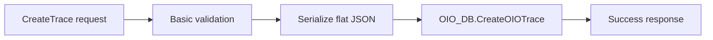
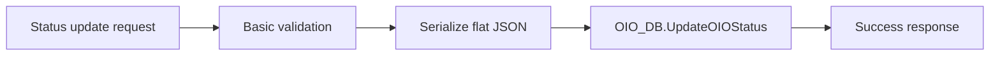
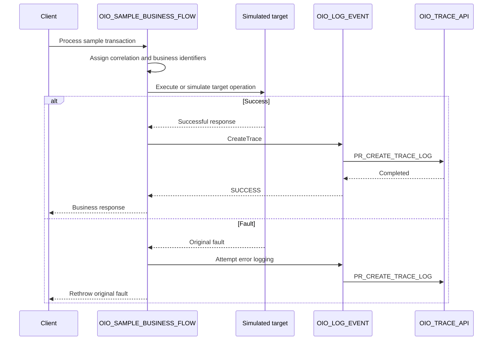

# OIO Oracle Integration implementation pattern

## 1. Purpose

This document is the source of truth for constructing and validating:

```text
OIO_LOG_EVENT
OIO_SAMPLE_BUSINESS_FLOW
```

The field contract is defined separately in the [logging contract](../docs/logging-contract.md), and field-level mapping is defined in the [mapping reference](mapping-reference.md).

## 2. Integration inventory

| Integration | Pattern | Processing | Responsibility |
|---|---|---|---|
| `OIO_LOG_EVENT` | Application integration | Synchronous | Reusable child integration that invokes the OIO database API. |
| `OIO_SAMPLE_BUSINESS_FLOW` | Application integration | Synchronous | Demonstration parent integration. |

Recommended initial integration version:

```text
01.00.0000
```

## 3. Build `OIO_LOG_EVENT`

### 3.1 Trigger

Use a REST Adapter trigger with multiple operations and a Pick action.

| Operation | Method | Resource | Procedure |
|---|---|---|---|
| `CreateTrace` | `POST` | `/events` | `PR_CREATE_TRACE_LOG` |
| `UpdateTransactionStatus` | `PATCH` | `/events/status` | `PR_UPDATE_TRANSACTION_STATUS` |

The operation is selected by the HTTP method and resource. No routing property is added to the flat OIO contract.

### 3.2 Create trace branch



Implementation steps:

1. Receive the canonical payload.
2. Apply basic request validation.
3. Serialize the request into the JSON CLOB expected by the package.
4. Invoke `OIO_TRACE_API.PR_CREATE_TRACE_LOG`.
5. Return a simple success response.

Suggested response:

```json
{
  "status": "SUCCESS",
  "operation": "CreateTrace",
  "message": "OIO trace event registered."
}
```

### 3.3 Status update branch



Implementation steps:

1. Receive the canonical payload.
2. Validate `integrationKey` and `transactionStatus`.
3. Confirm that at least one transaction identifier is present.
4. Serialize the request.
5. Invoke `OIO_TRACE_API.PR_UPDATE_TRANSACTION_STATUS`.
6. Return a simple success response.

Suggested response:

```json
{
  "status": "SUCCESS",
  "operation": "UpdateTransactionStatus",
  "message": "OIO transaction status event registered."
}
```

The caller must provide identifiers selective enough for the intended trace. The current database behavior may update multiple traces when the supplied combination is not unique.

### 3.4 Logger failure behavior

`OIO_LOG_EVENT` must propagate its mapping or database fault to the caller and must not invoke itself from its own error path.

The parent integration decides how to handle that logger fault. The complete rule for preserving and rethrowing the original business fault is documented in the [fault-handler pattern](fault-handler-pattern.md).

## 4. Build `OIO_SAMPLE_BUSINESS_FLOW`

### 4.1 Trigger

Use a REST trigger for simple testing.

| Operation | Method | Resource |
|---|---|---|
| `ProcessSampleTransaction` | `POST` | `/sample/transactions` |

Illustrative request:

```json
{
  "transactionId": "PO-100045",
  "sourceSystem": "EXTERNAL_PROCUREMENT",
  "simulateError": false
}
```

This is the sample business request, not the OIO contract.

### 4.2 Main orchestration



The detailed error path belongs to the [fault-handler pattern](fault-handler-pattern.md).

### 4.3 Sample configuration

Use one repository sample integration key, such as:

```text
SCM_PO_SYNC
```

The mapping must follow the labels configured for that key in `OIO_INTEGRATION_CFG`. See the [mapping reference](mapping-reference.md).

### 4.4 Status lifecycle demonstration

Add a test path that invokes:

```text
OIO_LOG_EVENT.UpdateTransactionStatus
```

An illustrative lifecycle is:

```text
RECEIVED -> IN_PROGRESS -> FAILED -> RESOLVED
```

These values are examples, not a global OIO status standard.

## 5. Parent-to-child invocation

Use the Local Integration adapter when both integrations are co-located.

This keeps the database connection inside the shared logger and prevents each business integration from duplicating the database mapping.

Activate and test `OIO_LOG_EVENT` before activating the parent integration.

## 6. OIC tracking

Recommended tracking fields for the sample flow:

| Tracking field | Source |
|---|---|
| Primary | Business transaction identifier |
| Secondary | Correlation identifier |
| Tertiary | Source request or batch identifier |

Native OIC tracking remains the technical execution record. OIO adds a persistent business-oriented history.

## 7. Activation and test order

1. Activate `OIO_LOG_EVENT`.
2. Test `CreateTrace`.
3. Test `UpdateTransactionStatus`.
4. Activate `OIO_SAMPLE_BUSINESS_FLOW`.
5. Run success, business-error, technical-error, and status-update scenarios.
6. Compare the OIC flow identifiers with the OIO database rows.

## 8. End-to-end acceptance criteria

- [ ] The parent invokes the child through a local integration call.
- [ ] A create call produces one master trace and one initial event.
- [ ] Optional approved payload content produces a payload row.
- [ ] A status update appends an event without creating a second master trace.
- [ ] A target fault is registered with `logLevel = E`.
- [ ] A logger failure does not replace the original business fault.
- [ ] OIC and database versions and the validation date are documented.
- [ ] Published artifacts follow the repository security guidance.

## 9. Related documentation

- [Connection setup](connection-setup.md)
- [Mapping reference](mapping-reference.md)
- [Fault-handler pattern](fault-handler-pattern.md)
- [Logging contract](../docs/logging-contract.md)
- [JSON examples](../contracts/examples/README.md)

## 10. Official Oracle references

- [Receive requests for multiple resources in a single REST Adapter trigger](https://docs.oracle.com/en/cloud/paas/application-integration/integrations-user/expose-multiple-operations-pick-action.html)
- [Invoke a child integration from a parent integration](https://docs.oracle.com/en/cloud/paas/application-integration/integrations-user/invoke-co-located-integration-from-parent-integration-oic.html)
