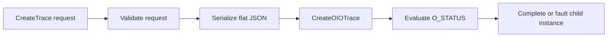
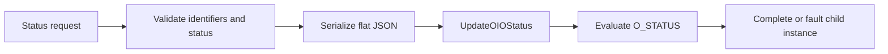
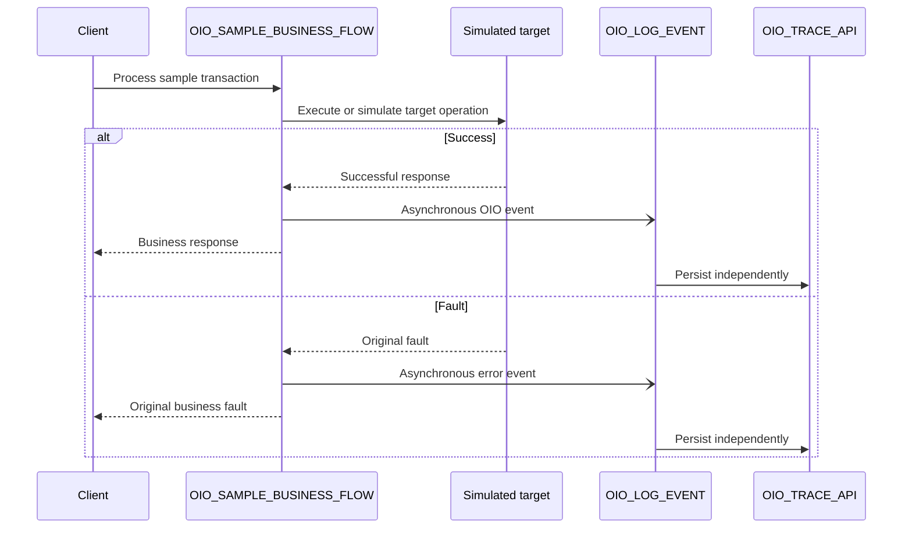

# OIO Oracle Integration implementation pattern

## 1. Purpose

This document is the source of truth for the Oracle Integration runtime behavior of:

```text
OIO_LOG_EVENT
OIO_SAMPLE_BUSINESS_FLOW
```

`OIO_LOG_EVENT` is asynchronous and one-way so observability persistence remains outside the parent business integration's response path.

Field definitions and validation rules are maintained in the [logging contract](../docs/logging-contract.md). OIC field mapping and serialization are maintained in the [mapping reference](mapping-reference.md).

## 2. Integration inventory

| Integration | Pattern | Responsibility |
|---|---|---|
| `OIO_LOG_EVENT` | Application integration; asynchronous one-way | Persist OIO events independently of the parent execution path. |
| `OIO_SAMPLE_BUSINESS_FLOW` | Application integration | Demonstrate success, status-update, and fault scenarios. |

The published v1 exports use version `01.00.0000`.

## 3. Asynchronous semantics

The parent continues after Oracle Integration accepts the asynchronous child request. Therefore:

- the parent does not wait for Database Adapter or PL/SQL execution;
- no OIO application response payload is returned to the parent;
- request acceptance is not proof that persistence completed;
- mapping, database, or package failures after acceptance belong to the child instance;
- OIO data is eventually consistent with the parent execution.

The handoff itself can still fail before acceptance. The fault-handling implications are defined in the [fault-handler pattern](fault-handler-pattern.md).

## 4. `OIO_LOG_EVENT` design

### 4.1 Trigger and operations

Use a REST Adapter trigger configured as asynchronous one-way. When using multiple resources and a Pick action, keep each OIO operation asynchronous one-way.

| Operation | Method | Resource | Procedure |
|---|---|---|---|
| `CreateTrace` | `POST` | `/events` | `PR_CREATE_TRACE_LOG` |
| `UpdateTransactionStatus` | `PATCH` | `/events/status` | `PR_UPDATE_TRANSACTION_STATUS` |

The HTTP operation selects the branch; no routing property is added to the flat OIO contract.

### 4.2 Create trace



Runtime sequence:

1. Receive the canonical payload.
2. Apply basic request validation.
3. Serialize the flat request into the JSON CLOB expected by the package.
4. Invoke `OIO_TRACE_API.PR_CREATE_TRACE_LOG`.
5. Complete normally when `O_STATUS = SUCCESS`.
6. Otherwise execute `Throw New Fault`, using `O_MESSAGE` as diagnostic context.

### 4.3 Update transaction status



Runtime sequence:

1. Receive the canonical payload.
2. Validate `integrationKey`, `transactionStatus`, and the presence of at least one transaction identifier.
3. Serialize the request.
4. Invoke `OIO_TRACE_API.PR_UPDATE_TRANSACTION_STATUS`.
5. Complete normally when `O_STATUS = SUCCESS`.
6. Otherwise execute `Throw New Fault`, using `O_MESSAGE` as diagnostic context.

The supplied transaction identifiers must be selective enough for the intended trace. The current database implementation updates every trace that matches the supplied non-null identifiers.

### 4.4 Logger failure behavior

A mapping, Database Adapter, or PL/SQL failure after asynchronous acceptance remains on the `OIO_LOG_EVENT` child instance and does not propagate back to a parent that has already continued.

`OIO_LOG_EVENT` must not invoke itself from its own fault path. Use native Oracle Integration monitoring, recovery, and an approved notification mechanism for logger failures.

## 5. `OIO_SAMPLE_BUSINESS_FLOW` design

The sample parent demonstrates the handoff without making OIO persistence part of the business response path.

Illustrative request:

```json
{
  "transactionId": "PO-100045",
  "sourceSystem": "EXTERNAL_PROCUREMENT",
  "simulateError": false
}
```

This is a sample business request, not the OIO logging contract.



Use a repository sample integration key such as `SCM_PO_SYNC`, and map its attributes according to `OIO_INTEGRATION_CFG`.

A lifecycle test may use values such as:

```text
RECEIVED -> IN_PROGRESS -> FAILED -> RESOLVED
```

These statuses are illustrative and are not a global OIO status standard.

## 6. Parent-to-child invocation

When parent and child integrations are co-located, use the Local Integration adapter to invoke the active `OIO_LOG_EVENT` integration and map the canonical request.

Keeping the database connection inside the reusable logger avoids duplicating Database Adapter mappings across business integrations.

Activate and validate `OIO_LOG_EVENT` before activating dependent parent integrations.

## 7. Tracking and operational monitoring

Use business and correlation identifiers that allow parent and child instances to be related operationally. The parent and child remain separate Oracle Integration instances.

Monitor at least:

- failed or recoverable `OIO_LOG_EVENT` instances;
- accepted events that do not produce the expected OIO record;
- unusual persistence delays;
- repeated database or package failures.

## 8. Validation order

1. Activate `OIO_LOG_EVENT`.
2. Submit `CreateTrace`; verify the child instance and resulting trace/event records.
3. Submit `UpdateTransactionStatus`; verify that a new event is appended to the existing trace.
4. Activate `OIO_SAMPLE_BUSINESS_FLOW`.
5. Run success, business-error, technical-error, handoff-failure, and child-runtime-failure scenarios.
6. Compare the parent instance, child instance, and OIO database records.
7. Record the Oracle Integration version, database version, and validation date.

## 9. Acceptance criteria

- [ ] Parent integrations invoke `OIO_LOG_EVENT` asynchronously.
- [ ] Parent execution does not wait for database persistence.
- [ ] Parent and child are observable as separate integration instances.
- [ ] Create produces the expected master trace and initial event.
- [ ] Status update appends an event without creating a second master trace.
- [ ] A child runtime failure does not alter an already completed parent outcome.
- [ ] A handoff failure does not replace the parent's original business or technical fault.
- [ ] Failed child instances can be identified operationally.
- [ ] Published artifacts contain no secrets or production-sensitive data.

## 10. Related documentation

- [Connection setup](connection-setup.md)
- [Mapping reference](mapping-reference.md)
- [Fault-handler pattern](fault-handler-pattern.md)
- [Logging contract](../docs/logging-contract.md)
- [JSON examples](../contracts/examples/README.md)

## 11. Official Oracle references

- [Configure a REST Adapter trigger to work asynchronously](https://docs.oracle.com/en/cloud/paas/application-integration/rest-adapter/configure-rest-trigger-that-works-asynchronously.html)
- [Differences between synchronous and asynchronous integrations](https://docs.oracle.com/en/cloud/paas/application-integration/integrations-user/differences-between-asynchronous-synchronous-integrations.html)
- [Invoke a child integration from a parent integration](https://docs.oracle.com/en/cloud/paas/application-integration/integrations-user/invoke-co-located-integration-from-parent-integration-oic.html)
- [Receive requests for multiple resources in a single REST Adapter trigger](https://docs.oracle.com/en/cloud/paas/application-integration/integrations-user/expose-multiple-operations-pick-action.html)
- [Error-handling actions, including Throw New Fault and Re-throw Fault](https://docs.oracle.com/en/cloud/paas/application-integration/integrations-user/error-handling-category.html)
