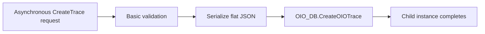
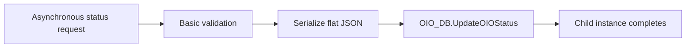
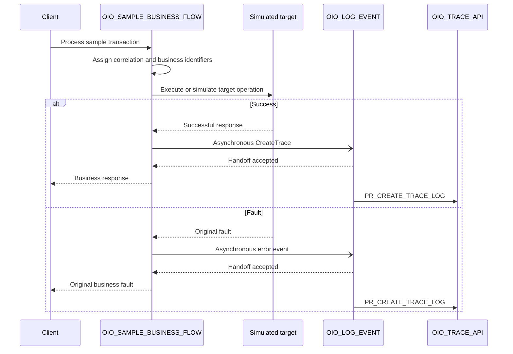

# OIO Oracle Integration implementation pattern

## 1. Purpose

This document is the source of truth for constructing and validating:

```text
OIO_LOG_EVENT
OIO_SAMPLE_BUSINESS_FLOW
```

`OIO_LOG_EVENT` is intentionally asynchronous and one-way. Its purpose is to decouple observability persistence from the business integration's response path.

The field contract is defined in the [logging contract](../docs/logging-contract.md), and field-level mapping is defined in the [mapping reference](mapping-reference.md).

## 2. Integration inventory

| Integration | Pattern | Processing | Responsibility |
|---|---|---|---|
| `OIO_LOG_EVENT` | Application integration | Asynchronous, fire-and-forget | Persist OIO events independently of the parent execution path. |
| `OIO_SAMPLE_BUSINESS_FLOW` | Application integration | Defined by the sample use case | Demonstrate the asynchronous logging handoff. |

Recommended initial integration version:

```text
01.00.0000
```

## 3. Asynchronous design semantics

The parent dispatches the logging request and continues after Oracle Integration accepts the asynchronous handoff.

This means:

- the parent does not wait for the Database Adapter or PL/SQL package to finish;
- the parent does not receive an OIO business response payload;
- request acceptance is not proof that the event was persisted;
- mapping, database, or package failures after acceptance belong to the child integration instance;
- OIO data is eventually consistent with the parent execution;
- operational monitoring must include failed or recoverable `OIO_LOG_EVENT` instances.

The handoff still has a small invocation cost and can fail before acceptance. The pattern reduces coupling and runtime impact; it does not make the dispatch itself infallible or free.

## 4. Build `OIO_LOG_EVENT`

### 4.1 Trigger

Use a REST Adapter trigger configured as asynchronous one-way. Do not configure the endpoint to return an application response.

If using multiple resources and a Pick action, configure each operation as asynchronous one-way.

| Operation | Method | Resource | Procedure |
|---|---|---|---|
| `CreateTrace` | `POST` | `/events` | `PR_CREATE_TRACE_LOG` |
| `UpdateTransactionStatus` | `PATCH` | `/events/status` | `PR_UPDATE_TRANSACTION_STATUS` |

The operation is selected by the HTTP method and resource. No routing property is added to the flat OIO contract.

### 4.2 Create trace branch



Implementation steps:

1. Receive the canonical payload.
2. Apply basic request validation.
3. Serialize the request into the JSON CLOB expected by the package.
4. Invoke `OIO_TRACE_API.PR_CREATE_TRACE_LOG`.
5. Complete the child instance.

No application-level success response is returned to the parent. The asynchronous invocation confirms receipt or acceptance, not persistence completion.

### 4.3 Status update branch



Implementation steps:

1. Receive the canonical payload.
2. Validate `integrationKey` and `transactionStatus`.
3. Confirm that at least one transaction identifier is present.
4. Serialize the request.
5. Invoke `OIO_TRACE_API.PR_UPDATE_TRANSACTION_STATUS`.
6. Complete the child instance.

The caller must provide identifiers selective enough for the intended trace. The current database behavior may update multiple traces when the supplied combination is not unique.

### 4.4 Child failure behavior

A mapping, Database Adapter, or PL/SQL failure after asynchronous acceptance is recorded against the `OIO_LOG_EVENT` child instance. It does not propagate back to a parent that has already continued.

The child must not invoke itself from its own fault path. Use native OIC monitoring, recovery, and an approved notification mechanism for logger failures.

## 5. Build `OIO_SAMPLE_BUSINESS_FLOW`

### 5.1 Trigger

Use a REST trigger for simple testing. The parent may be synchronous or asynchronous according to the business use case; the logger remains asynchronous.

| Operation | Method | Resource |
|---|---|---|
| `ProcessSampleTransaction` | `POST` | `/sample/transactions` |

Illustrative request:

```json
{
  "transactionId": "PO-100045",
  "sourceSystem": "EXTERNAL_PROCUREMENT",
  "simulateError": false
}
```

This is the sample business request, not the OIO contract.

### 5.2 Main orchestration



The parent does not wait for the database operation. The detailed dispatch-failure and original-fault behavior is documented in the [fault-handler pattern](fault-handler-pattern.md).

### 5.3 Sample configuration

Use one repository sample integration key, such as:

```text
SCM_PO_SYNC
```

The mapping must follow the labels configured for that key in `OIO_INTEGRATION_CFG`. See the [mapping reference](mapping-reference.md).

### 5.4 Status lifecycle demonstration

Add a test path that invokes:

```text
OIO_LOG_EVENT.UpdateTransactionStatus
```

An illustrative lifecycle is:

```text
RECEIVED -> IN_PROGRESS -> FAILED -> RESOLVED
```

These values are examples, not a global OIO status standard.

## 6. Parent-to-child invocation

Use the Local Integration adapter when both integrations are co-located. Select the active asynchronous child integration and map the canonical request.

The local asynchronous handoff keeps the database connection inside the shared logger and prevents each business integration from duplicating the database mapping.

Activate and test `OIO_LOG_EVENT` before activating the parent integration.

## 7. OIC tracking and operational monitoring

Recommended tracking fields for the sample flow:

| Tracking field | Source |
|---|---|
| Primary | Business transaction identifier |
| Secondary | Correlation identifier |
| Tertiary | Source request or batch identifier |

The parent and child are separate integration instances. Use the correlation and business identifiers to relate them operationally.

Monitor at least:

- asynchronous child failures;
- recoverable child instances;
- accepted events that did not produce database rows;
- delays between the parent handoff and event persistence;
- repeated failures caused by database or package unavailability.

## 8. Activation and test order

1. Activate `OIO_LOG_EVENT`.
2. Submit `CreateTrace` and confirm asynchronous acceptance.
3. Verify the child instance and eventual database rows.
4. Submit `UpdateTransactionStatus` and verify the appended event.
5. Activate `OIO_SAMPLE_BUSINESS_FLOW`.
6. Run success, business-error, technical-error, dispatch-failure, and child-runtime-failure scenarios.
7. Compare the parent instance, child instance, and OIO database rows.

## 9. End-to-end acceptance criteria

- [ ] The parent invokes `OIO_LOG_EVENT` asynchronously.
- [ ] The parent does not wait for database persistence.
- [ ] The parent receives no application-level success payload from the logger.
- [ ] Parent and child appear as separate OIC instances.
- [ ] A create event eventually produces one master trace and one initial event.
- [ ] A status update eventually appends an event without creating a second master trace.
- [ ] A child database failure does not change the already completed parent outcome.
- [ ] A handoff failure does not replace the parent's original business fault.
- [ ] Failed child instances can be identified and handled operationally.
- [ ] OIC and database versions and the validation date are documented.
- [ ] Published artifacts follow the repository security guidance.

## 10. Related documentation

- [Connection setup](connection-setup.md)
- [Mapping reference](mapping-reference.md)
- [Fault-handler pattern](fault-handler-pattern.md)
- [Logging contract](../docs/logging-contract.md)
- [JSON examples](../contracts/examples/README.md)

## 11. Official Oracle references

- [Configure a REST Adapter trigger to work asynchronously](https://docs.oracle.com/en/cloud/paas/application-integration/rest-adapter/configure-rest-trigger-that-works-asynchronously.html)
- [Differences between synchronous and asynchronous integrations](https://docs.oracle.com/en/cloud/paas/application-integration/integrations-user/differences-between-asynchronous-synchronous-integrations.html)
- [Invoke a child integration from a parent integration](https://docs.oracle.com/en/cloud/paas/application-integration/integrations-user/invoke-co-located-integration-from-parent-integration-oic.html)
- [Receive requests for multiple resources in a single REST Adapter trigger](https://docs.oracle.com/en/cloud/paas/application-integration/integrations-user/expose-multiple-operations-pick-action.html)
